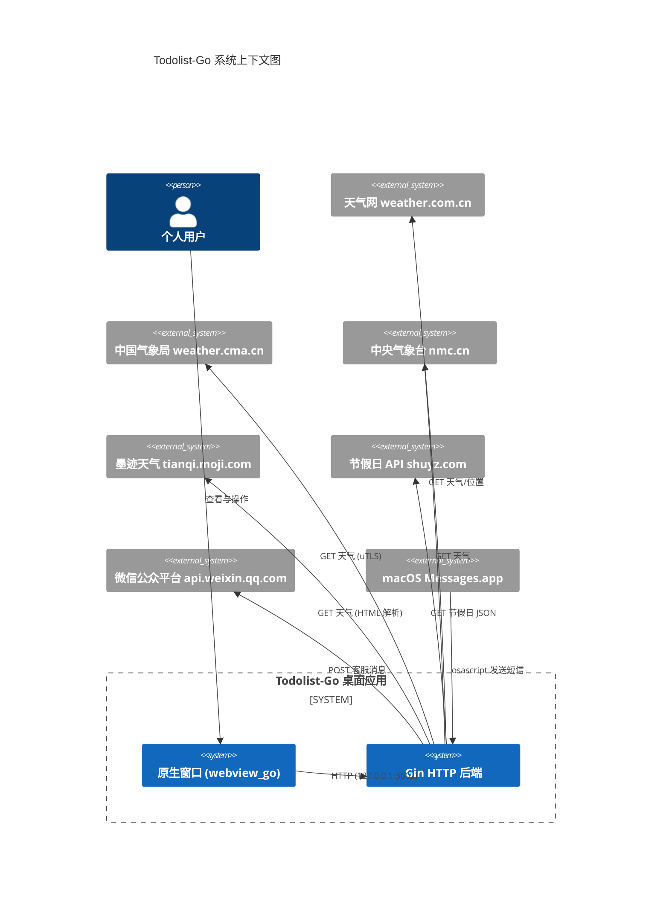

# 项目总览

> 生成时间：2026-08-01 ｜ 代码版本：master@d6f93a4

## 1. 项目定位

**Todolist-Go** 是一个基于 Go + webview_go 的**单机桌面待办事项管理应用**，内嵌 Gin HTTP 服务作为后端，前端为静态 HTML/JS 页面。它从前身（Python + Webview 版本）迁移而来，定位为：

- **目标用户**：单用户个人使用（macOS / Linux / Windows 桌面）。
- **核心价值**：本地化、零依赖部署、跨平台一致的桌面体验；围绕 `todo.txt` 文件做任务管理，并集成日历、节假日、节日、天气查询与定时天气通知。
- **形态**：一个原生窗口（webview）加载本地 HTTP 服务（127.0.0.1:3002）渲染的页面；后端负责文件读写、外部 API 抓取、缓存与通知。

> 注：项目保留 [app/cmd/server/server.go](file:///Users/huji/work/MyProject/code_mine/gitee/todo_manager/todolist-go/app/cmd/server/server.go) 作为纯 HTTP 服务端入口，可用于无 GUI 环境调试或服务化部署。

## 2. 系统上下文（C1）

下图展示系统与外部角色 / 外部系统的关系。中心为本应用，箭头标注交互方向与协议。



> 说明：短信通知通过 macOS 的 `osascript` 调用 Messages.app 发送，因此**仅在 macOS 下可用**（见 [ADR-0004](05-adr/0004-通知渠道选型.md)）。

## 3. 技术栈总览

| 类别 | 选型 | 版本 | 说明 |
|---|---|---|---|
| 语言 / Go | Go | 1.25.0 | 来自 [go.mod](file:///Users/huji/work/MyProject/code_mine/gitee/todo_manager/todolist-go/go.mod) |
| Web 框架 | gin-gonic/gin | v1.9.1 | HTTP 路由与中间件 |
| 桌面窗口 | webview/webview_go | v0.0.0-20240831 | 原生 WebView（macOS WKWebView / Linux WebKitGTK / Windows WebView2） |
| HTML 解析 | PuerkitoBio/goquery | v1.12.0 | 解析墨迹天气 HTML |
| TLS 指纹 | refraction-networking/utls | v1.8.2 | 模拟 Chrome 120 指纹，绕过 CMA 反爬 |
| 日志 | log/slog | stdlib | 结构化日志，动态级别 |
| HTTP 客户端 | net/http | stdlib | 自定义 Client + Transport |
| JSON | encoding/json | stdlib | 配置与缓存序列化 |
| 配置 | 自研 | - | [utils/config_util.go](file:///Users/huji/work/MyProject/code_mine/gitee/todo_manager/todolist-go/app/utils/config_util.go) |
| 缓存 | 自研 | - | 三级缓存（内存 → 文件 → 自定义加载器），见 [utils/cache_util.go](file:///Users/huji/work/MyProject/code_mine/gitee/todo_manager/todolist-go/app/utils/cache_util.go) |
| 测试 | testing | stdlib | 单元 + 集成测试，位于 `tests/` |
| 构建脚本 | bash | - | [build.sh](file:///Users/huji/work/MyProject/code_mine/gitee/todo_manager/todolist-go/build.sh) 支持三平台交叉编译 |

> 注：README 提到 `gin-contrib/cors`，但实际代码用自定义中间件设置 CORS 头（见 [core.go](file:///Users/huji/work/MyProject/code_mine/gitee/todo_manager/todolist-go/app/core.go#L55-L68)），go.mod 中未引入该依赖，README 描述已过期。

## 4. 业务域概览

| 业务域 | 后端包 | 前端模块 | 说明 |
|---|---|---|---|
| 任务管理 | [routes/file_routes.go](file:///Users/huji/work/MyProject/code_mine/gitee/todo_manager/todolist-go/app/routes/file_routes.go) | `static/js/business/todo/` | 基于 `todo*.txt` 文件的 CRUD |
| 日历视图 | （前端为主） | `static/js/business/todo/calendar_renderer.js` | 任务在日历上的分布 |
| 节假日 | [routes/holiday_routes.go](file:///Users/huji/work/MyProject/code_mine/gitee/todo_manager/todolist-go/app/routes/holiday_routes.go) | `static/js/business/common/holiday_manager.js` | 抓取第三方节假日数据并缓存 |
| 节日管理 | [routes/festival_routes.go](file:///Users/huji/work/MyProject/code_mine/gitee/todo_manager/todolist-go/app/routes/festival_routes.go) | `static/js/business/festival_manager.js` | 用户自定义节日配置 |
| 天气查询 | [routes/weather_routes.go](file:///Users/huji/work/MyProject/code_mine/gitee/todo_manager/todolist-go/app/routes/weather_routes.go) + [services/weather/](file:///Users/huji/work/MyProject/code_mine/gitee/todo_manager/todolist-go/app/services/weather) | `static/js/business/weather/` | 多源聚合（墨迹/天气网/CMA/NMC） |
| 天气通知 | [services/auto_weather_notify_service.go](file:///Users/huji/work/MyProject/code_mine/gitee/todo_manager/todolist-go/app/services/auto_weather_notify_service.go) + [notify_service.go](file:///Users/huji/work/MyProject/code_mine/gitee/todo_manager/todolist-go/app/services/notify_service.go) | （无前端，定时任务） | 短信 + 微信客服消息推送 |
| 位置定位 | [services/location_service.go](file:///Users/huji/work/MyProject/code_mine/gitee/todo_manager/todolist-go/app/services/location_service.go) | `static/js/business/weather/location_handler.js` | IP 定位 + 区县编码匹配 |
| 服务状态 | [routes/status_routes.go](file:///Users/huji/work/MyProject/code_mine/gitee/todo_manager/todolist-go/app/routes/status_routes.go) | （前端心跳） | 健康检查 + 优雅关闭 |

## 5. 顶层目录结构

```
todolist-go/
├── app/                      # 应用代码（Go）
│   ├── cmd/                  # 可执行入口
│   │   ├── desktop/          # 桌面应用（webview 窗口）
│   │   └── server/           # 纯 HTTP 服务端
│   ├── routes/               # HTTP 路由层
│   ├── services/             # 业务服务层
│   │   └── weather/          # 天气数据源适配子包
│   ├── utils/                # 工具层（缓存/配置/日志/常量）
│   └── core.go               # App 结构体与装配
├── data/                     # 运行期数据（可读写）
│   ├── cache/                # 缓存文件
│   ├── config/               # 配置文件 (app/notify/festival)
│   ├── mock/                 # Mock 数据
│   ├── weather/              # 区域编码等静态数据
│   └── todo*.txt             # 任务文件
├── icons/                    # 应用图标（多平台）
├── static/                   # 前端静态资源
│   ├── css/  fonts/  img/
│   ├── js/business/          # 业务前端模块
│   ├── js/third_party/       # 第三方库（jQuery/Bootstrap/Chart.js/lunar.js/tailwind）
│   └── pages/                # HTML 页面
├── tests/                    # 测试代码（统一 package tests）
├── docs/architecture/        # 本文档目录
├── go.mod  go.sum
├── build.sh  test_app.sh     # 构建 / 开发运行脚本
└── version.txt               # 版本号 (1.0.0)
```

> 项目布局未严格遵循 golang-standards/project-layout 的 `internal/` / `pkg/` 约定，而是采用扁平的 `app/{cmd,routes,services,utils}` 结构。详见 [ADR-0002 项目布局选型](05-adr/0002-项目布局选型.md)。

## 6. 版本与演进线索

- 当前版本：`1.0.0`（[version.txt](file:///Users/huji/work/MyProject/code_mine/gitee/todo_manager/todolist-go/version.txt)）。
- 由 Python 版迁移而来：代码注释中多处保留 `对应 Python ...` 字样（如 [core.go](file:///Users/huji/work/MyProject/code_mine/gitee/todo_manager/todolist-go/app/core.go#L17) 与 [app/cmd/desktop/app.go](file:///Users/huji/work/MyProject/code_mine/gitee/todo_manager/todolist-go/app/cmd/desktop/app.go#L27)），API 路径与数据结构对齐 Python 版以便前端复用。
- `app_config.json` 仍保留 `node` / `python` 端口配置项，用于多语言版本共存调试。
