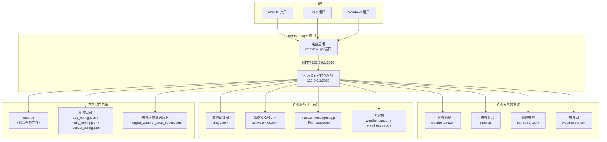
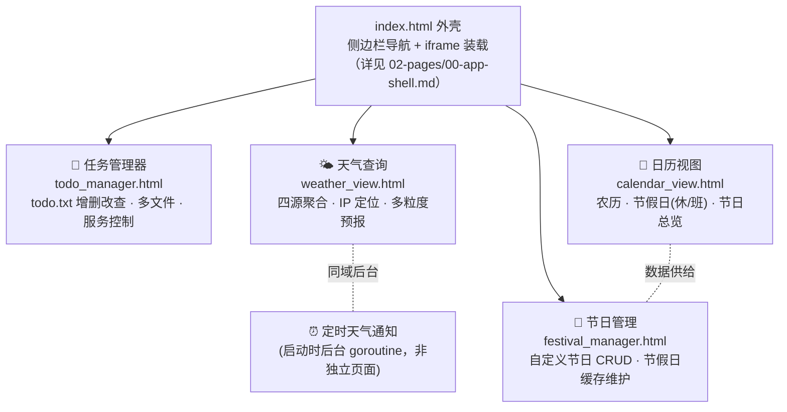
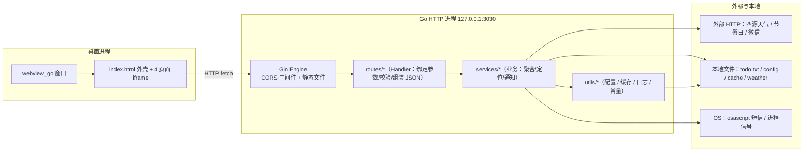
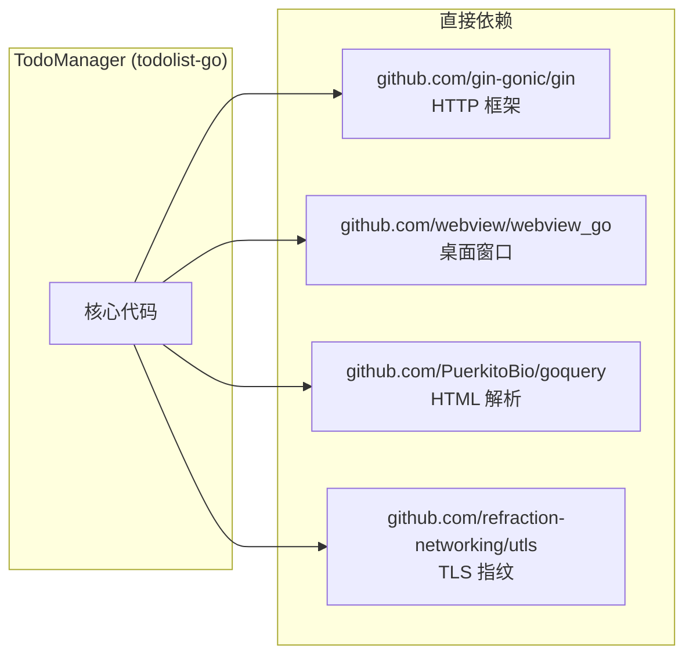

# 项目总览

> 生成时间：2026-09-10 ｜ 代码版本：master@40a4f33 ｜ 应用版本：v1.0.2

本文从 **App 页面维度** 介绍 TodoManager：先看它在系统中的位置，再看四个业务页面如何拼成整个应用，最后给出「页面 → 前端模块 → API → 后端服务」的映射总表。深入某个页面请看 [02-pages/](02-pages/)；**无法归入单个页面的独立业务**（天气定时通知、节假日/节日数据域）请看 [03-business/](03-business/)；跨页面的技术地基请看 [04-infrastructure.md](04-infrastructure.md)。

## 1. 项目定位

TodoManager 是一个 **本地化、零依赖部署** 的跨平台桌面应用，基于 Go + webview_go 构建。围绕纯文本 `todo.txt` 做任务管理，集成日历视图、节假日/节日管理、**四源天气聚合查询**与定时通知能力。

- **目标用户**：个人开发者、需要轻量级「任务 + 天气 + 日历」一体工具的桌面用户。
- **核心价值**：不依赖云端服务、开箱即用、多源天气兜底保证可用性。
- **组织方式**：一个桌面窗口 = 一个网页外壳（`index.html`）+ 四个业务页面（iframe）。**所有能力都从「页面」出发被组织**，这也是本文档的主线。

## 2. 系统上下文（C1）

TodoManager 对外只表现为一个本地进程：内嵌 Gin HTTP 服务监听 `127.0.0.1:3030`，webview 加载本地页面；后端按需访问外部天气源、节假日 API 与通知渠道。

| 角色/系统 | 交互方式 | 说明 |
|---|---|---|
| 终端用户 ↔ 桌面窗口 | GUI 交互 | webview_go 提供原生窗口，加载本地 HTML 页面 |
| 前端页面 ↔ 后端服务 | HTTP REST | 本地 127.0.0.1:3030，无网络暴露 |
| 后端 ↔ 天气数据源 | HTTPS GET/POST | 并发四源聚合，字段级合并 |
| 后端 ↔ todo 文件 | 文件读写 | 纯文本 txt，无数据库 |
| 后端 ↔ macOS Messages | osascript 调用 | 通过 AppleScript 发送 iMessage |
| 后端 ↔ 微信公众号 | HTTPS API | 获取 access_token → 发送客服消息 |

## 3. App 页面地图

应用首屏即外壳 `index.html`，折叠侧边栏把用户导向四个业务页面。每页都是一个独立 iframe，各自负责一块业务：

| 页面 | 一句话职责 | 文档 |
|---|---|---|
| 首页外壳 | 侧边栏导航 + iframe 拼装 + 跨页消息桥 | [02-pages/00-app-shell.md](02-pages/00-app-shell.md) |
| 任务管理器 | 围绕 `todo.txt` 的任务工作台 + 应用级服务控制 | [02-pages/todo.md](02-pages/todo.md) |
| 天气查询 | 四源并发天气 + IP 定位，最复杂的业务链路 | [02-pages/weather.md](02-pages/weather.md) |
| 日历视图 | 农历 + 法定节假日 + 节日的整月日历 | [02-pages/calendar.md](02-pages/calendar.md) |
| 节日管理 | 自定义节日维护 + 节假日缓存管理 | [02-pages/festival.md](02-pages/festival.md) |

> **不属于任何页面的独立业务**：有些业务无法拆进单一页面，已各自成文——
> - [03-business/weather-notify.md](03-business/weather-notify.md)：天气定时通知（纯后台、无页面，复用天气取数 + 短信/微信渠道）
> - [03-business/holiday-festival.md](03-business/holiday-festival.md)：节假日/节日/农历数据域（被日历页与节日页共享的内核）

## 4. 页面 ↔ 后端映射总表

这张表是「页面维度」理解全项目的索引：每个页面对应哪些前端模块、哪些 API、落到哪些后端服务与存储。

| 页面 | 前端核心模块 | 主要 API | 后端 Handler | 依赖服务 | 数据 / 存储 |
|---|---|---|---|---|---|
| 任务管理器 | `todo_manager.js`、`todo/task_parser.js`、`todo/task_list_renderer.js`、`todo/task_operations.js`、`todo/calendar_renderer.js` | `/api/file/scan`、`/api/file/read/:filename`、`/api/file/write/:filename`、`/api/check-status`、`/api/shutdown` | `file_routes`、`status_routes` | `cache_util`、`config_util` | `data/todo*.txt` |
| 天气查询 | `weather_view.js`、`weather/location_handler.js`、`weather/weather_renderer.js` | `/api/weather/ip-location`、`/api/weather/weather-area-codes`、`/api/weather/weather-info` | `weather_routes` | `weather_service`(+`services/weather/*`)、`location_service`、`notify_service`、`auto_weather_notify_service` | `data/weather/*.json`、`data/cache` |
| 日历视图 | `calendar_view.js`、`common/holiday_manager.js`、`common/lunar_utils.js` | `/api/holiday/cache`、`/api/festival/config`（经共享模块） | `holiday_routes`、`festival_routes` | `cache_util`、`config_util` | 节假日缓存、`festival_config.json` |
| 节日管理 | `festival_manager.js`、`common/holiday_manager.js`、`common/lunar_utils.js` | `/api/festival/config`、`/api/festival/save`、`/api/holiday/cache`、`/api/holiday/refresh-cache` | `festival_routes`、`holiday_routes` | `config_util`、`cache_util` | `festival_config.json`、节假日缓存 |

> 天气域的「定时通知」不挂在任何页面上，而是随服务启动以后台 goroutine 运行，复用 `weather_service` + `notify_service`，在 [weather.md](02-pages/weather.md) §6 详述。

## 5. 端到端请求总链路

无论哪个页面，请求都走同一条「页面 → Gin → handler → service → 外部源/文件（含缓存）」主干。这也是全项目的骨架：

**统一约定**（贯穿所有页面，详见 [04-infrastructure.md](04-infrastructure.md)）：

- **数据风格**：`map[string]interface{}` 前后端透传，无 struct 实体、无 ORM。
- **响应约定**：业务 handler 绝大多数返回 HTTP 200，错误以 JSON body 里的 `error` 字段表达（校验类错误除外，如文件名非法 403、缺参数 400）。
- **基础设施**：配置来自 `data/config/*.json`，数据靠 `data/cache` 两级缓存（内存 + 文件），日志走 `slog`。

## 6. 技术栈总览

| 类别 | 选型 | 版本 | 说明 |
|---|---|---|---|
| 语言 | Go | 1.25+ | 模块路径 `todolist-go` |
| 桌面框架 | webview_go | v0.0.0-20240831 | 原生窗口 + 嵌入浏览器 |
| HTTP 框架 | Gin | v1.9.1 | 路由 + 中间件 + 参数绑定 |
| HTML 解析 | goquery | v1.12.0 | 墨迹/天气网 HTML 抓取解析 |
| TLS 指纹模拟 | uTLS | v1.8.2 | 绕过 CMA 反爬（Chrome 120 指纹） |
| 日志 | log/slog | stdlib | Go 1.21+ 结构化日志 |
| 构建 | go build + lipo | - | macOS universal 二进制 |
| CI/CD | GitHub Actions | - | tag 触发三平台 Release |
| 前端 | 原生 HTML/JS | - | 无构建链，零依赖 |
| 样式 / 图表 | Tailwind CSS / Chart.js / jQuery | CDN | 由 `static/js/third_party` 或 CDN 引入 |

### 6.1 关键选型理由

| 决策 | 理由 | 被否掉的方案 |
|---|---|---|
| **webview_go + 原生 HTML/JS** | 项目是个人工具，**简单够用**优先：二进制 ~5MB、无 IPC 需要（走本地 HTTP 完全够）、前端无构建步骤，CI 只需编译 Go。调试时可直接用浏览器打开 `http://127.0.0.1:3030` | Wails（有 IPC、官方脚手架，但二进制 ~30MB、构建链复杂）、Tauri（体积小但需 Rust 工具链、学习曲线）、Electron（生态成熟但 ~150MB、内存高） |
| **天气多源并发 + 字段级合并** | 单一数据源经常挂（CMA 反爬、墨迹临时失效、天气网数据不全）；用户要的是「有天气」而非「最准的天气」；字段级合并比**整源替换**更鲁棒——A 源给温度、B 源给描述，不必等某个源字段齐全 | 只接单一源、整源降级切换（等某个源全部字段就绪） |
| **macOS universal 二进制** | Apple Silicon 与 Intel Mac 并存，需要一个 DMG 覆盖两派用户；必须在 macOS runner 上构建而非 Linux 交叉编译——webview 的系统库、Info.plist、hdiutil 打包都依赖 macOS | Linux runner 交叉编译 macOS 包（系统库与打包工具链缺失） |

> **这些决策的代价**：天气后端复杂度上升（四个 Service + 合并逻辑）；CI 多一倍 macOS 构建时间（amd64/arm64 分别编译后 `lipo -create` 合并），Linux / Windows 仅构建单架构本机包。

## 7. 依赖图（直接依赖）

---

*文档生成于 2026-09-10，基于代码版本 master@40a4f33。如发现内容与代码不符，请以代码为准并及时更新文档。*
