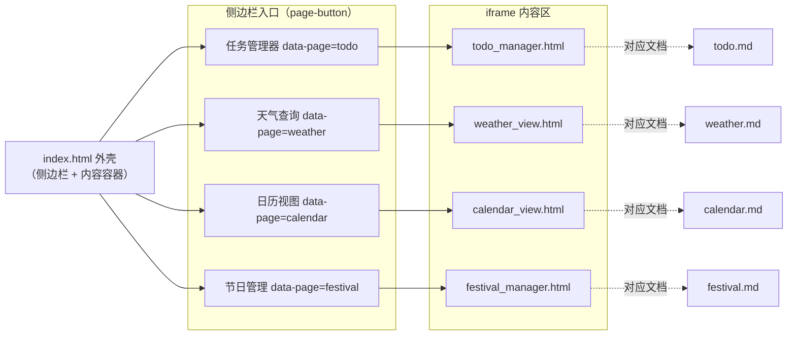
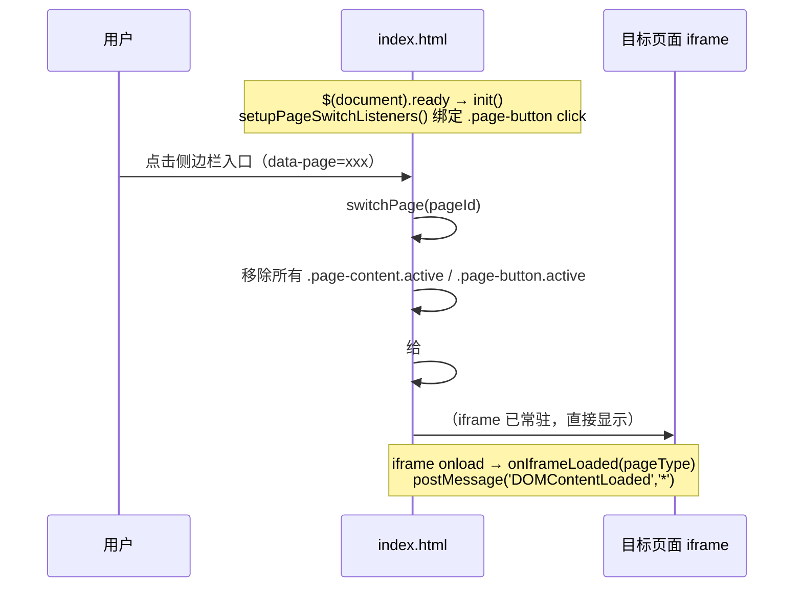

# 首页外壳（App Shell）

> 生成时间：2026-09-10 ｜ 代码版本：master@40a4f33 ｜ 应用版本：v1.0.2

TodoManager 是一个「单窗口 + 多页面」的桌面应用。所有业务页面都寄宿在同一个 webview 窗口里，由 `index.html` 这层**外壳（App Shell）**负责导航与页面拼装。本文是整个「页面维度」文档体系的入口，先理解外壳，再进入四大业务页面。

## 1. 外壳定位

| 维度 | 说明 |
|---|---|
| 载体文件 | [static/pages/index.html](../../../static/pages/index.html) |
| 访问路径 | 根路径 `/`，由 [serveIndex](../../../app/core.go#L95-L103) 返回 |
| 职责 | 侧边栏导航、iframe 页面装载、页面显隐切换、跨页面消息桥接 |
| 不负责 | 任何具体业务（任务/天气/日历/节日都在各自 iframe 页面内实现） |

## 2. 页面地图

外壳用一条极窄的**折叠式侧边栏**（默认仅 14px，hover 展开）承载四个入口，右侧主区域用四个 `<iframe>` 分别装载业务页面：

| 侧边栏入口 | iframe 页面 | 后端主要触点 | 详细文档 |
|---|---|---|---|
| 任务管理器 | `todo_manager.html` | `/api/file/*`、`/api/check-status`、`/api/shutdown` | [todo.md](todo.md) |
| 天气查询 | `weather_view.html` | `/api/weather/*` | [weather.md](weather.md) |
| 日历视图 | `calendar_view.html` | `/api/file/read/*`、`/api/holiday/cache` | [calendar.md](calendar.md) |
| 节日管理 | `festival_manager.html` | `/api/festival/*`、`/api/holiday/refresh-cache` | [festival.md](festival.md) |

## 3. 导航与页面切换机制

外壳本身**不做路由跳转**，而是四个 iframe 常驻，通过 CSS class `active` 控制显隐：

关键点（均在 [index.html 内联脚本](../../../static/pages/index.html#L172-L219)）：

- **页面切换即显隐**：`switchPage(pageId)` 只切换 `active` class，不重新加载 iframe，因此切换页面时业务页面状态得以保留。
- **跨页面消息桥接**：每个 iframe 的 `onload` 触发 `onIframeLoaded(pageType)`，外壳用 `contentWindow.postMessage('DOMContentLoaded', '*')` 通知子页面「DOM 已就绪」，子页面据此延后初始化重逻辑（如自动定位、拉取节假日）。
- **折叠侧边栏**：`.sidebar-btn` 默认 `width:14px` 只露图标，hover 展开到 `w-28` 显示文字，兼顾桌面小窗口空间利用。

## 4. 页面静态资源如何被服务

外壳与子页面都通过绝对路径 `/assets/...`、iframe 相对路径 `xxx.html` 引用资源，由 [core.go Setup()](../../../app/core.go#L44-L92) 的路由映射兜住：

| 前端引用 | 命中路由 | 实际文件 |
|---|---|---|
| `/`（webview 首屏） | `serveIndex` | `static/pages/index.html` |
| iframe `src="todo_manager.html"` | `GET /:filename` → `servePageWithExt` | `static/pages/todo_manager.html` |
| `/assets/js/...`、`/assets/css/...` | `Router.Static("/assets", staticDir)` | `static/js`、`static/css` |
| `/static/...`、`/src/client/...` | 兼容别名 Static 路由 | `static/` |

> `/pages/:filename`（`servePage`）另提供带 `.html` 补全的页面直访能力，方便单独调试某个子页面。

## 5. 技术要点与已知问题

- **同源、无跨域**：外壳与子页面同源于 `127.0.0.1:3030`，`postMessage` 的目标域写 `'*'` 仅在本地回环环境下可接受。
- **iframe 常驻的代价**：四个业务页面在首屏即并行创建，各自会独立发起初始化请求（如天气页自动 IP 定位）。首屏网络开销与页面数成正比；如需优化可改为懒加载 iframe。
- **页面间弱耦合**：任务管理器与日历视图都读取 todo.txt、日历视图与节日管理都依赖节假日缓存，但它们运行在**彼此独立的 iframe 上下文**中，不共享 JS 内存，靠服务端缓存（[04-infrastructure.md](../04-infrastructure.md) §缓存）间接达成一致。

---

*文档生成于 2026-09-10，基于代码版本 master@40a4f33。如发现内容与代码不符，请以代码为准并及时更新文档。*
