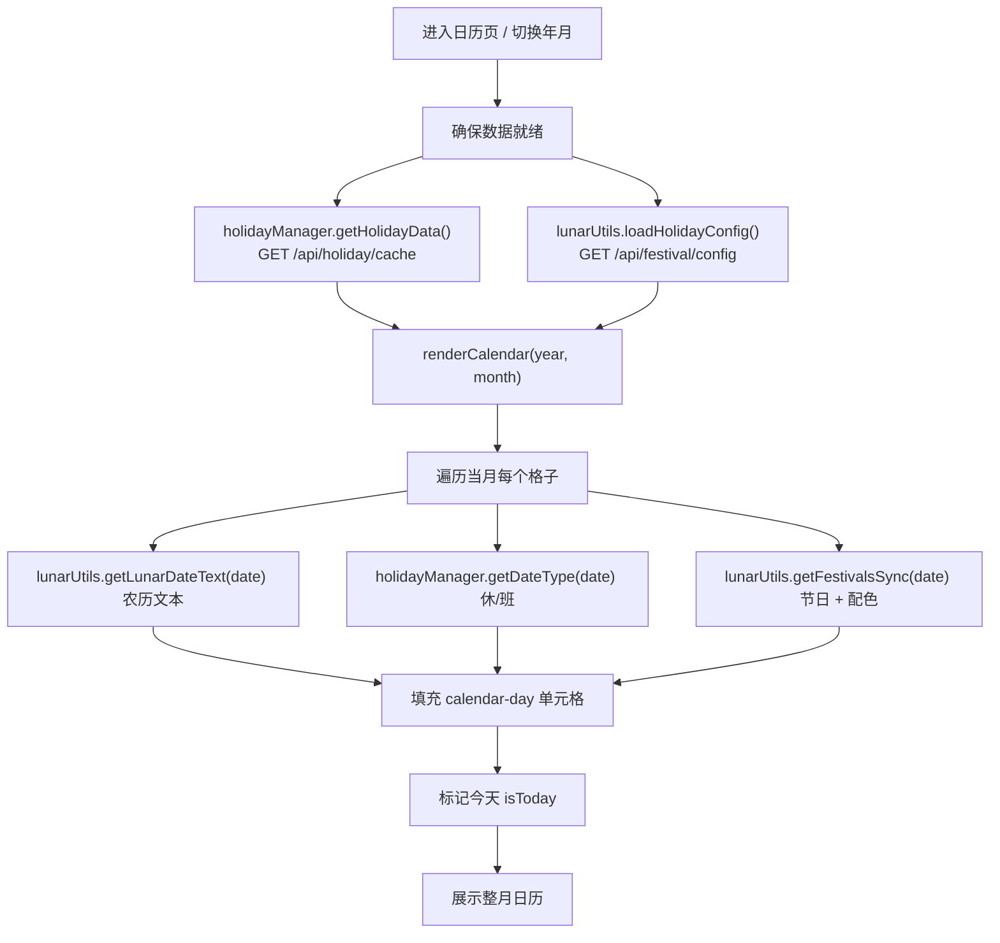
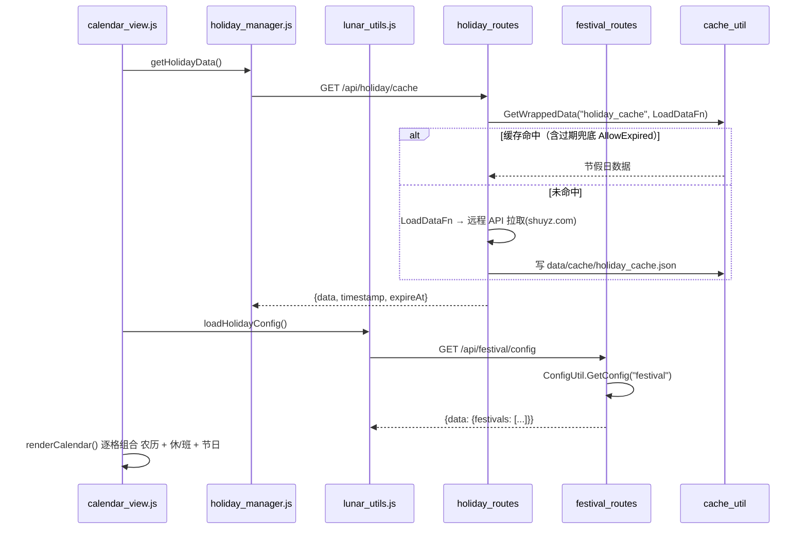

# 页面：日历视图（calendar）

> 生成时间：2026-09-10 ｜ 代码版本：master@40a4f33 ｜ 应用版本：v1.0.2

- 所属：[首页外壳](00-app-shell.md) 侧边栏入口 `data-page=calendar`，iframe 加载 `calendar_view.html`
- 后端触点：`/api/holiday/cache`、`/api/festival/config`（均通过共享模块间接调用）

> 本页依赖的「节假日 / 节日 / 农历」三套数据从何而来、如何缓存与判定，是与[节日管理页](festival.md)**共享的内核**，已独立成文：→ [03-business/holiday-festival.md](../03-business/holiday-festival.md)。本页只讲「如何把这三套数据合成一个月历并渲染」。

## 1. 页面定位与用户价值

一个**整月农历/节假日/节日日历**。每个日期格同时呈现三类信息：公历日、农历日（含节气/干支等文本）、以及当天是否为国家法定节假日（休/班）或用户自定义节日。

它回答的是「这个月哪天放假、哪天调休上班、哪天有节日、今天农历是什么」这类日程问题，与[任务管理器页](todo.md)里那张「标注哪天有任务的迷你日历」是**两个不同用途的日历**：

| 对比 | 本页（日历视图） | 任务页内的迷你日历 |
|---|---|---|
| 目的 | 农历 / 节假日 / 节日总览 | 快速跳到有任务的日期 |
| 数据源 | 节假日缓存 + 节日配置 + 农历算法 | 当前 todo 文件内容 |
| 前端 | [calendar_view.js](../../../static/js/business/calendar_view.js) | [calendar_renderer.js](../../../static/js/business/todo/calendar_renderer.js) |
| 是否读 todo.txt | ❌ 不读 | ✅ 读 |

## 2. 界面构成

[calendar_view.html](../../../static/pages/calendar_view.html)（约 240 行）：

| 区块 | 元素 | 职责 |
|---|---|---|
| 头部 | 标题「日历」、图例（休/班/节日/今天 配色说明） | 视觉规范 |
| 时间导航 | `#year-selector` `#month-selector` `#prev-month` `#btn-today` `#next-month` | 切换年月、回到今天 |
| 日历网格 | `#calendar-view`（`#calendar-day-template` 模板克隆生成 `calendar-day` 单元格） | 6×7 网格，每格含公历 + 农历 + 节日/假期标记 |

页面逻辑几乎全在 [calendar_view.js](../../../static/js/business/calendar_view.js)，并依赖两个**跨页面共享的全局模块**：

| 共享模块 | 暴露 | 提供能力 |
|---|---|---|
| [common/holiday_manager.js](../../../static/js/business/common/holiday_manager.js) | `window.holidayManager` | `getHolidayData()` 拉取/缓存法定节假日；`getDateType(date)` 判定某日是 休/班/工作日 |
| [common/lunar_utils.js](../../../static/js/business/common/lunar_utils.js) | `window.lunarUtils` | `getLunarDateText()` 农历文本；`getFestivalsSync()` 当日节日；`getFestivalTypeClass()` 节日配色；`loadHolidayConfig()` 加载节日配置 |

底层农历计算依赖第三方库 [third_party/lunar.js](../../../static/js/third_party/lunar.js)。

## 3. 核心业务流程

## 4. 前后端调用链

本页不直接 `fetch`，数据请求全部下沉到共享模块，再打到节假日 / 节日两类接口：

要点：

- **节假日**走后端 `/api/holiday/cache`，命中 100 天有效缓存或过期兜底文件，只有真正缺失时才回源远程 API。
- **节日**走 `/api/festival/config`，读本地 `festival_config.json`；本页只读，编辑在[节日管理页](festival.md)。
- **农历**为纯前端计算（`lunar.js`），不经过后端。

## 5. 涉及的数据实体与配置

| 数据 | 载体 | 说明 |
|---|---|---|
| 法定节假日 | 后端缓存 `holiday_cache`（源 shuyz.com，TTL 100 天，AllowExpired） | 判定 休/班 |
| 自定义节日 | `data/config/festival_config.json` 的 `festivals[]` | 名称、日期、类型（公历/农历） |
| 农历/节气 | 前端 `lunar.js` 实时计算 | 无需网络 |

## 6. 技术要点与已知问题

- **共享模块的全局单例**：`window.holidayManager` / `window.lunarUtils` 被日历页与节日页复用；但因两页在各自 iframe 内，实例并不跨页共享，各自的节假日数据靠**后端缓存**达成一致。
- **休/班判定依赖缓存新鲜度**：调休安排更新后，若 `holiday_cache` 仍是旧的 100 天缓存，页面可能显示过时。用户可在节日管理页点「刷新节假日缓存」强制回源（`/api/holiday/refresh-cache`，见 [festival.md](festival.md)）。
- **农历节日 vs 公历节日混排**：`getFestivalsSync` 同时处理公历与农历日期，跨闰月等边界依赖 `lunar.js` 正确性，改动节日类型时以 `lunar_utils.js` 为准。

---

*文档生成于 2026-09-10，基于代码版本 master@40a4f33。*
