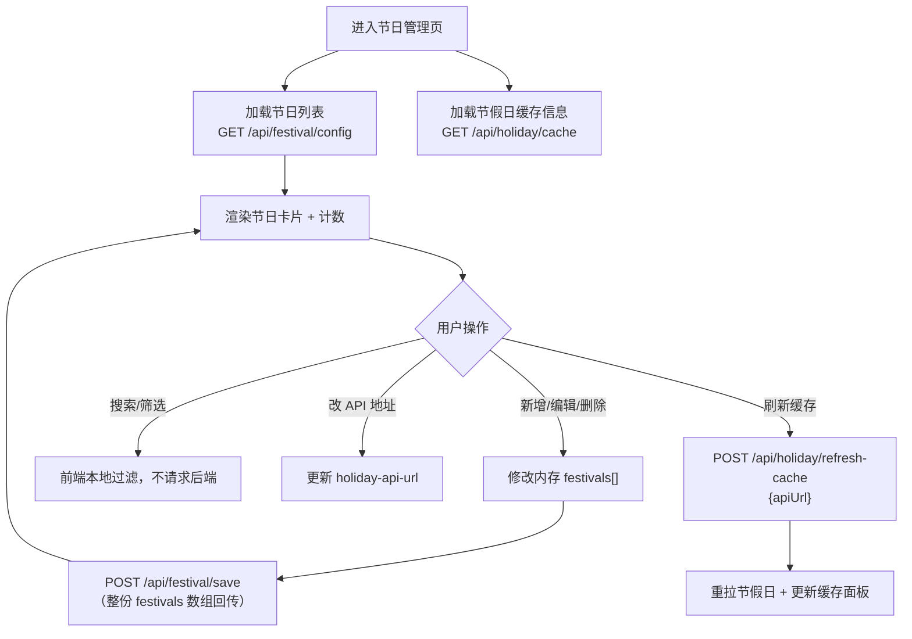
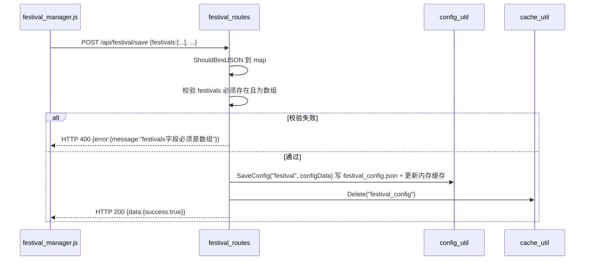
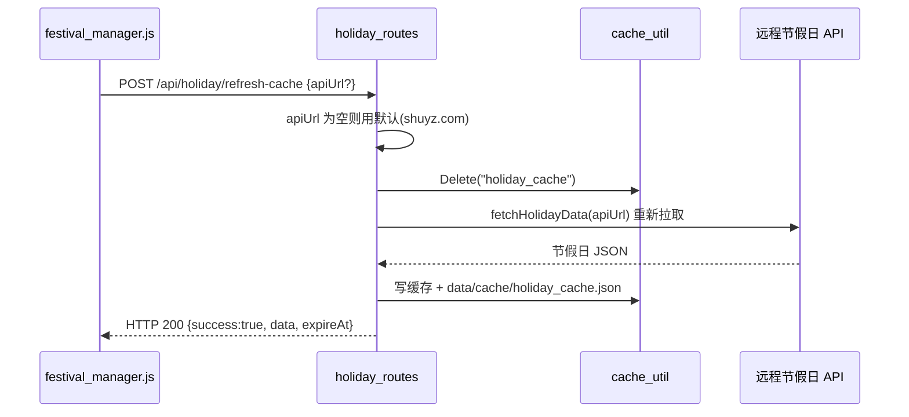

# 页面：节日管理（festival）

> 生成时间：2026-09-10 ｜ 代码版本：master@40a4f33 ｜ 应用版本：v1.0.2

- 所属：[首页外壳](00-app-shell.md) 侧边栏入口 `data-page=festival`，iframe 加载 `festival_manager.html`
- 后端触点：`/api/festival/config`、`/api/festival/save`、`/api/holiday/cache`、`/api/holiday/refresh-cache`

> 本页维护的「节假日 / 节日」数据与后端缓存、远程源机制，是与[日历视图页](calendar.md)**共享的内核**，已独立成文：→ [03-business/holiday-festival.md](../03-business/holiday-festival.md)。本页只讲「节日 CRUD 与缓存刷新在页面上如何发生」。

## 1. 页面定位与用户价值

节日管理的**后台配置台**：用户在这里维护「自定义节日」清单（新增/编辑/删除/搜索/筛选），并管理「法定节假日」数据源（查看缓存状态、切换 API 地址、强制刷新缓存）。

它是[日历视图页](calendar.md)的**数据供给端**——日历上显示的每一个节日、每一天「休/班」标记，其源头都是这里维护的 `festival_config.json` 与节假日缓存。两个页面构成「配置 → 展示」的闭环。

| 用户目标 | 页面能力 |
|---|---|
| 建立个人节日库 | 新增 / 编辑 / 删除节日（公历或农历日期、类型） |
| 找回某个节日 | 名称搜索 + 类型筛选 + 日期类型筛选 |
| 掌握数据规模 | 节日总数 `#festival-count` |
| 维护节假日数据 | 查看缓存信息、配置远程 API 地址、一键刷新缓存 |

## 2. 界面构成

[festival_manager.html](../../../static/pages/festival_manager.html)（约 468 行）+ [festival_manager.js](../../../static/js/business/festival_manager.js)（约 839 行），同样复用共享模块 `holidayManager` / `lunarUtils`：

| 区块 | 元素 | 职责 |
|---|---|---|
| 节假日缓存面板 | `#holiday-cache-info` `#holiday-api-url`（placeholder「请输入节假日API地址」） `#btn-refresh-holiday-cache` `#btn-view-holiday-info` | 展示缓存时间/状态、改源地址、强制刷新 |
| 节日工具栏 | `#festival-count` `#btn-add-festival` `#search-input`（搜索节日名称） `#type-filter` `#date-type-filter` | 计数、新增、搜索、双重筛选 |
| 节日列表 | 节日卡片列表 + 编辑/删除操作 | 逐条维护 |
| 编辑弹窗 | 节日表单（名称、公历/农历日期、类型、备注） | 新增/修改单条节日 |

## 3. 核心业务流程



> 与任务页类似的「全量回写」策略：节日增删改在内存完成后，把整份 `festivals` 数组 POST 回 `/api/festival/save` 覆盖配置文件。

## 4. 前后端调用链

### 4.1 保存节日（`/api/festival/save`）

Handler [saveFestivalConfig](../../../app/routes/festival_routes.go#L33-L75)：



### 4.2 刷新节假日缓存（`/api/holiday/refresh-cache`）

Handler [refreshHolidayCache](../../../app/routes/holiday_routes.go#L116-L139)：



## 5. 涉及的数据实体与配置

**节日配置实体**（`data/config/festival_config.json`）：

```json
{
  "festivals": [
    { "name": "示例节日", "date": "2026-01-01", "type": "...", "dateType": "公历|农历", "remark": "..." }
  ]
}
```

字段由前端表单定义、后端只做「`festivals` 必须为数组」的结构校验后原样落盘。

**节假日数据来源**：默认远程 API `https://www.shuyz.com/githubfiles/china-holiday-calender/master/holidayAPI.json`（见 [holiday_routes.go](../../../app/routes/holiday_routes.go#L18)），可在本页 `#holiday-api-url` 覆盖。

**缓存 Key**：`holiday_cache`（TTL 100 天，`AllowExpired` + 固定 `SourceFile`）、`festival_config`（保存后失效）。

## 6. 技术要点与已知问题

- **两页共享数据、各自渲染**：本页写入 `festival_config.json` 与刷新 `holiday_cache` 后，[日历视图页](calendar.md)下次加载即可看到更新；跨 iframe 一致性完全依赖后端缓存与文件，不靠前端事件广播。
- **`SaveConfig` 的读缓存不一致点**：`saveFestivalConfig` 同时调用 `ConfigUtil.SaveConfig`（更新配置内存缓存）与 `CacheUtil.Delete("festival_config")`（清另一套缓存 key）。节日读取走 `GetConfig("festival")` 路径，改动节日配置逻辑时需注意这两处缓存不要漏清。
- **节假日 API 可指向任意地址**：`#holiday-api-url` 允许改源，风险由本地单用户场景承担；返回结构需与既有解析约定兼容，否则 `getDateType` 判定会退化。
- **强制刷新是同步回源**：`/api/holiday/refresh-cache` 内会等待远程拉取，网络慢时按钮响应会卡顿（HTTP Client 超时 10s）。

---

*文档生成于 2026-09-10，基于代码版本 master@40a4f33。*
