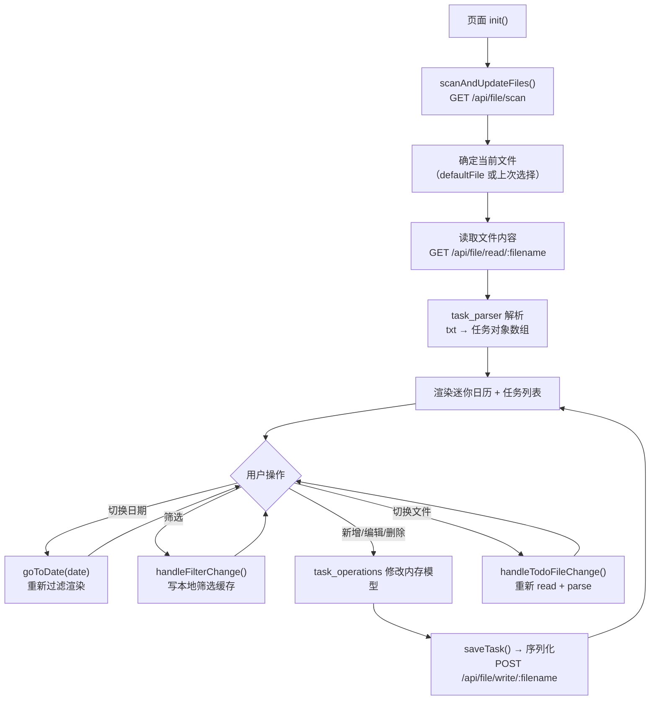
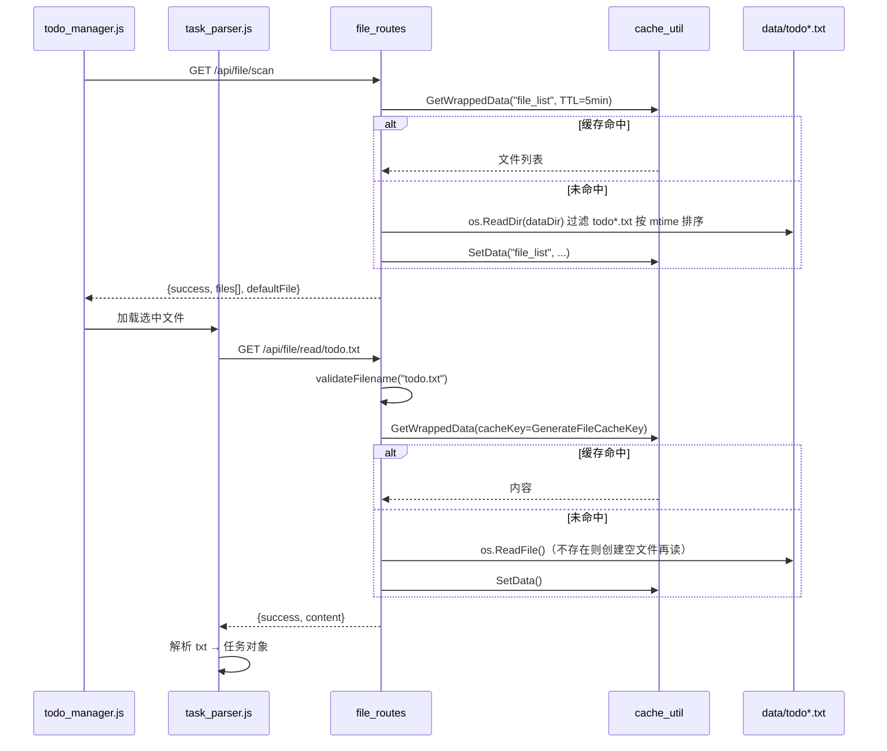
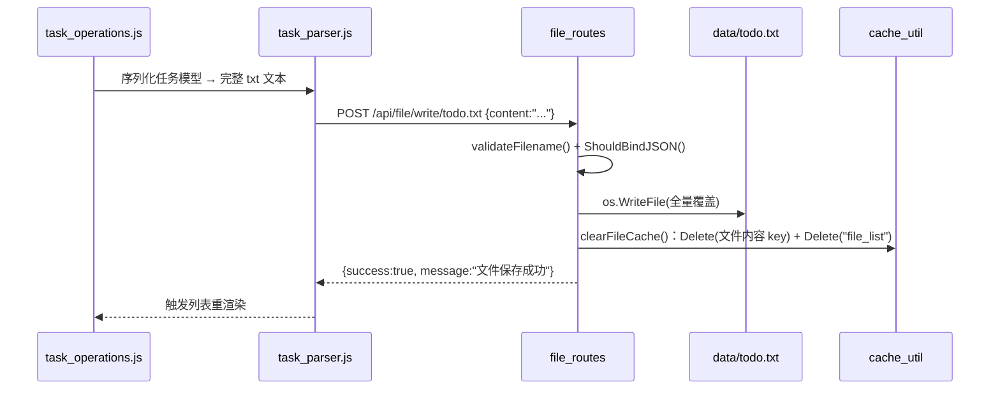

# 页面：任务管理器（todo）

> 生成时间：2026-09-10 ｜ 代码版本：master@40a4f33 ｜ 应用版本：v1.0.2

- 所属：[首页外壳](00-app-shell.md) 侧边栏入口 `data-page=todo`，iframe 加载 `todo_manager.html`
- 后端触点：`/api/file/*`、`/api/check-status`、`/api/shutdown`

## 1. 页面定位与用户价值

任务管理器是 TodoManager 的**默认首页与核心工作台**，围绕纯文本 `todo.txt` 提供「所见即所得」的任务管理：用户在页面上增删改查任务、按日期浏览、按条件筛选、在多个任务文件间切换，所有改动直接落盘到本地 `.txt` 文件——**没有数据库，文件即真相源**。

它同时承担**应用级控制**职责：内置服务器健康指示与「关闭服务」入口（对应整个桌面应用的退出）。

| 用户目标 | 页面能力 |
|---|---|
| 管理某一天的任务 | 日期导航（今/上/下月）、按日期归组任务 |
| 维护任务内容 | 新增 / 编辑 / 删除 / 完成态切换（弹窗表单） |
| 快速定位任务 | 多维筛选（状态、日期等，带本地筛选缓存） |
| 管理多个待办本 | 文件下拉切换、新建文件、导入 / 导出 |
| 控制应用 | 服务状态灯、优雅关闭服务 |

## 2. 界面构成

页面由 [todo_manager.html](../../../static/pages/todo_manager.html)（约 1000 行，Tailwind + 原生 JS）+ 一组 [static/js/business/todo/](../../../static/js/business/todo) 模块协作：

| 区块 | 前端职责 |
|---|---|
| 顶部工具栏 | 标题「任务管理器」、当前文件名 `#current-todo-file`、文件下拉切换、新建/导入/导出、服务控制按钮 `#btn-server-control` |
| 迷你日历 | 左侧月历，标注「有任务的日期」，点击某天联动右侧任务列表（`goToDate`） |
| 任务列表区 | 当前日期/筛选结果的任务卡片，含详情面板开关 `#toggle-detail-panel` |
| 筛选栏 | 「筛选任务」下拉，状态/日期等条件，选择结果缓存到本地 |
| 任务弹窗 | 新增/编辑任务的模态表单（`openAddTaskModal` / `saveTask`） |
| 通知与关闭弹窗 | 轻量 toast（`showNotification`）、优雅关闭确认弹窗 |

前端模块分工（`static/js/business/todo/`）：

| 模块 | 职责 |
|---|---|
| [todo_manager.js](../../../static/js/business/todo_manager.js) | 页面主控：初始化、事件绑定、文件切换、日期导航、服务控制 |
| [task_parser.js](../../../static/js/business/todo/task_parser.js) | `todo.txt` 文本 ⇄ 任务对象的双向解析/序列化，并封装文件读写请求 |
| [task_list_renderer.js](../../../static/js/business/todo/task_list_renderer.js) | 任务列表 DOM 渲染（分组、状态样式、详情面板） |
| [calendar_renderer.js](../../../static/js/business/todo/calendar_renderer.js) | 迷你日历渲染与「有任务日期」标记 |
| [task_operations.js](../../../static/js/business/todo/task_operations.js) | 任务增删改、完成态切换等操作逻辑 |

## 3. 核心业务流程

以用户操作为主线的页面生命周期：

> 写操作策略：**内存改 → 整文件序列化 → 全量写回**。任何一次任务变更都会把当前文件的完整文本重新 POST 回 `/api/file/write/:filename`，再由后端覆盖落盘，简单可靠。

## 4. 前后端调用链

### 4.1 读取任务（scan → read）

### 4.2 保存任务（write）

## 5. 涉及的数据实体与配置

**数据实体**：`todo.txt` 纯文本，每行一条任务。前端 `task_parser` 把它解析为带 `date`、`content`、状态、详情等字段的任务对象；后端**不理解任务语义**，只做文件字节级读写，任务格式约定完全在前端。

**文件命名约束**（安全边界）：[validateFilename()](../../../app/routes/file_routes.go#L88-L90) 仅允许 `todo` 前缀 + `.txt` 后缀，防止路径穿越。文件目录固定为 [GetDataDir()](../../../app/routes/file_routes.go#L27)（`data/`）。

**缓存策略**（详见 [04-infrastructure.md](../04-infrastructure.md)）：

| 缓存 Key | 内容 | TTL | AllowExpired |
|---|---|---|---|
| `file_list` | 任务文件列表 | 5 分钟 | ❌ |
| `GenerateFileCacheKey(filename)` | 单文件内容 | 5 分钟 | ❌ |

保存后通过 `clearFileCache` 双删（内容 key + 列表），保证下次读取拿到最新内容。

## 6. 技术要点与已知问题

- **文件即数据库**：无 ORM、无迁移，读写都是整文件覆盖；对大文件不友好（每次改动全量重写），但换来零依赖与「文本可直接手改」的可移植性。
- **缓存与「外部改文件」竞争**：若用户在应用外用编辑器改了 `todo.txt`，5 分钟内容缓存可能返回旧数据。绕过方式：切换文件触发 key 变化，或重启/清 `data/cache/`。
- **页面兼作应用控制面**：`/api/shutdown` 由 [status_routes](../../../app/routes/status_routes.go#L26-L37) 实现——收到请求后延迟 1s 向自身进程发 `SIGINT`，触发 webview 退出（见 [04-infrastructure.md](../04-infrastructure.md) §Graceful Shutdown）。`/api/check-status` 仅返回 `{success:true}` 作为健康探针。
- **前端主导业务规则**：任务格式、日期归组、筛选逻辑全在 JS；后端 file 路由是「带缓存与校验的受限文件读写器」。改动任务语义时优先看 `static/js/business/todo/`。

---

*文档生成于 2026-09-10，基于代码版本 master@40a4f33。*
