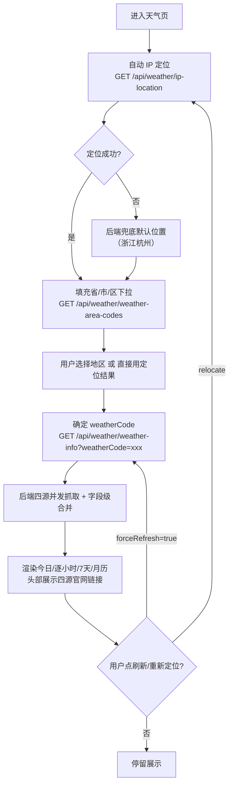
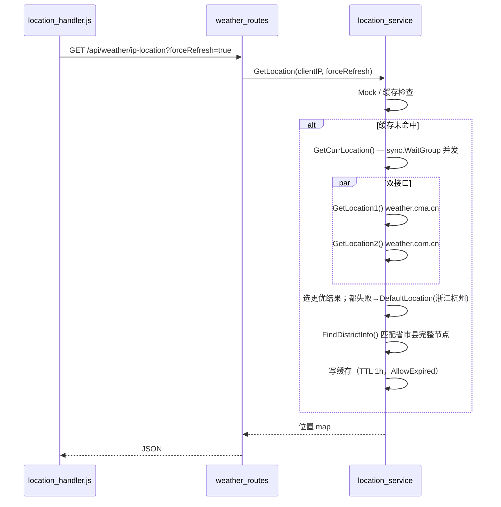
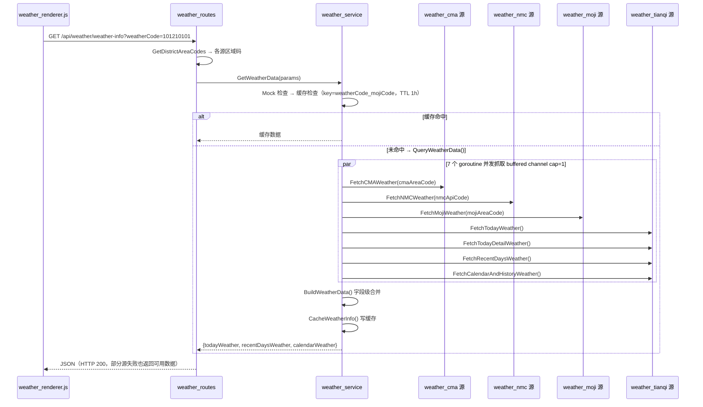
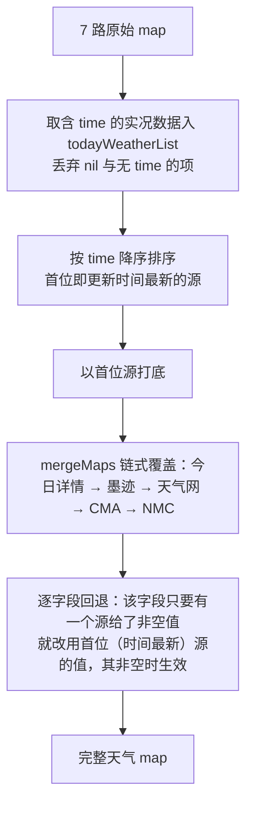

# 页面：天气查询（weather）

> 生成时间：2026-09-10 ｜ 代码版本：master@40a4f33 ｜ 应用版本：v1.0.2

- 所属：[首页外壳](00-app-shell.md) 侧边栏入口 `data-page=weather`，iframe 加载 `weather_view.html`
- 后端触点：`/api/weather/ip-location`、`/api/weather/weather-area-codes`、`/api/weather/weather-info`
- 关联选型理由：[01-overview.md](../01-overview.md) §6.1 （为什么做多源聚合而非单源）

天气查询是全项目**业务与技术复杂度最高**的页面：它把「定位在城市 → 选区域 → 并发抓四源 → 字段级合并 → 缓存」串成一条链路，是理解 TodoManager 后端设计的最佳样本。

## 1. 页面定位与用户价值

单城市天气看板。用户可通过 **IP 自动定位**或**省/市/区三级下拉**选定地区，页面展示该地今日实况、逐小时、未来 7 天与月历天气；头部另提供四个数据源的官网链接，供用户自行核对取数。

**核心价值**：不依赖任何单一天气服务商——四个公开源（中国气象局 CMA、中央气象台 NMC、墨迹天气、天气网）**并发抓取 + 字段级互补合并**，任一源失效都能被其他源兜底，最大化可用性。

## 2. 界面构成

[weather_view.html](../../../static/pages/weather_view.html) + 两个专职 JS 模块：

| 区块 | 元素 | 职责 |
|---|---|---|
| 城市头部 | `#city-name` `#city-code` `#current-date` | 展示当前查询地与日期 |
| 定位操作 | `#relocate-btn` `#force-refresh-btn` | 重新 IP 定位 / 绕过缓存强刷 |
| 地区选择 | `#province-select` `#city-select` `#district-select` | 省市区三级联动，产出 `weatherCode` |
| 状态区 | `#weather-loading` `#weather-error` `#weather-content` | 加载/错误/内容三态切换 |
| 今日天气 | `#weather-icon` `#weather-condition` `#weather-area` 等 | 实况：天气、温度、湿度、风力 |
| 扩展视图 | 逐小时 / 未来 7 天 / 月历 | 多粒度预报与历史 |
| 来源链接 | `#weather-links`（`#cma-link` `#nmc-link` `#moji-link` `#weather-com-cn-link`） | 按当前区域的各源编码拼出官网链接供用户点开核对；**不做字段级来源标注** |

前端模块分工：

| 模块 | 职责 |
|---|---|
| [weather_view.js](../../../static/js/business/weather_view.js) | 页面入口，装配定位与渲染模块 |
| [location_handler.js](../../../static/js/business/weather/location_handler.js) | IP 定位、省市区三级联动、`weatherCode` 解析（调 `/ip-location`、`/weather-area-codes`） |
| [weather_renderer.js](../../../static/js/business/weather/weather_renderer.js) | 天气数据渲染 + 发起 `/weather-info`（`WEATHER_API.WEATHER_INFO`） |

## 3. 核心业务流程

## 4. 前后端调用链

### 4.1 IP 定位（`/api/weather/ip-location`）

Handler [getIPLocation](../../../app/routes/weather_routes.go#L32-L38) → [services.GetLocation](../../../app/services/location_service.go#L234)：

### 4.2 天气查询（`/api/weather/weather-info`）— 四源并发聚合

Handler [getWeatherInfo](../../../app/routes/weather_routes.go#L53-L73) 先用 [GetDistrictAreaCodes](../../../app/services/location_service.go#L314)(`weatherCode`) 把统一编码翻译成各源自己的区域码（cma/nmc/moji/tianqi），再交给 [GetWeatherData](../../../app/services/weather_service.go#L453)：

**BuildWeatherData 合并策略**（按温度/湿度/风力/描述等维度做字段级互补，**不按源的官方/商业身份定优先级**）：

> 合并顺序决定兜底强弱：`mergeMaps` 只要 key 存在就**无条件覆盖**，链尾的 CMA/NMC 因此在第一步占优；第二步逐字段回退再把「更新时间最新的源」的优先级拉回来，但仅在该源该字段非空时生效。

## 5. 涉及的数据实体与配置

**区域编码体系**：前端只认一个统一 `weatherCode`，后端用 [merged_weather_area_codes.json](../../../data/weather/merged_weather_area_codes.json)（省市县树，叶子含 `mojiCode/cmaCode/nmcCode/nmcNameCode`）翻译成各源编码。该映射经 `sync.Once` 一次性加载后只读。

**天气数据结构**（`map[string]interface{}` 透传，无 struct）：

| 字段 | 内容 |
|---|---|
| `todayWeather` | weather/temperature/tempMin/tempMax/humidity/wind… |
| `recentDaysWeather[]` | date/weather/tempMin/tempMax/wind（未来 7 天，主源为天气网 `FetchRecentDaysWeather`，其为空时用 NMC 的 `dailyWeather` 兜底） |
| `calendarWeather[]` | 月历 + 历史温度（天气网月历 + 墨迹历史回填修正） |

**相关配置**（`app_config.json`）：`server.api_timeout_*`（各源 HTTP 超时，uTLS 默认较长）、`features.mock.enabled`（返回 `data/mock/mock_weather_info.json`）、`features.cache.enabled`、`features.default_location`。

**缓存 Key**：天气 `weatherCode_mojiCode`（TTL 1h，AllowExpired）；IP 位置（TTL 1h，AllowExpired）；区域编码（永久）。

## 6. 相关独立业务

天气数据还被一项**没有页面的后台业务——天气定时通知**复用（服务启动时以 goroutine 拉起，向短信/微信推送播报，与本页共享 `weather_service` 取数与同一套缓存）。因其不属于任何页面，已拆为独立文档：→ [03-business/weather-notify.md](../03-business/weather-notify.md)。

## 7. 技术要点与已知问题

- **uTLS 反爬**：CMA 有 TLS 指纹检测，需 `refraction-networking/utls` 模拟 Chrome 指纹（选型理由见 [01-overview.md §6.1](../01-overview.md)）。uTLS 失败会降级到其余三源。
- **合并有「空值覆盖」风险**：`mergeMaps` 只要 key 存在就赋值，某源返回 `""` 会覆盖上游已取到的有效值；随后的逐字段回退只在「时间最新源该字段非空」时才修正，若该字段只有其他源有值，最终仍会留下空值。
- **无全局超时兜底**：`QueryWeatherData` 用阻塞 `<-ch` 等齐 7 个结果，单源卡死会拖到其 HTTP Client 超时（10~20s）才返回；缺一个总超时 goroutine，是已知技术债。
- **HTTP 恒 200**：即使四源全失败也返回 200、data 为空，前端需自行判空渲染，而非依赖状态码。
- **未系统性使用 context**：请求为短平快同步调用，handler 不向 service 传 `context`（见 [04-infrastructure.md](../04-infrastructure.md) §Context）。
- **首屏并发定位**：进入页面即触发 IP 定位，与外壳其他 iframe 的初始化请求叠加，属正常现象。

---

*文档生成于 2026-09-10，基于代码版本 master@40a4f33。*
