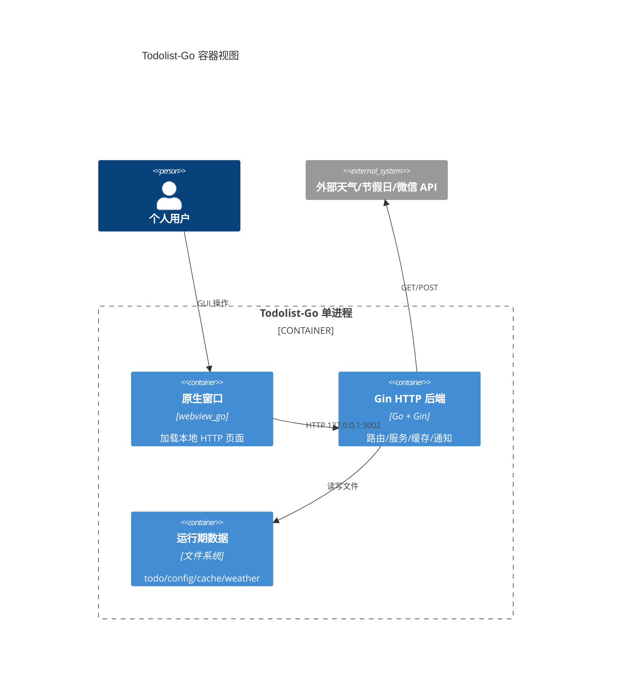
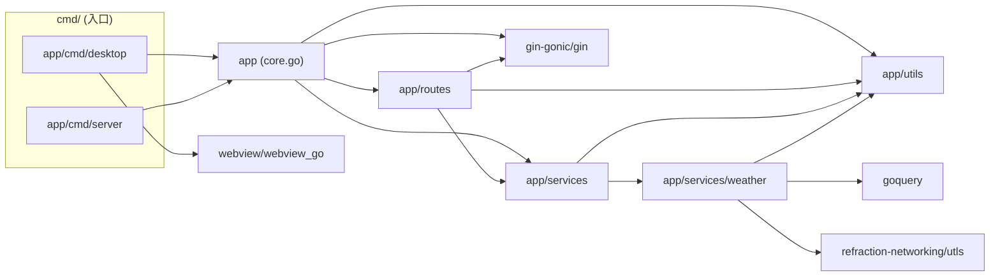
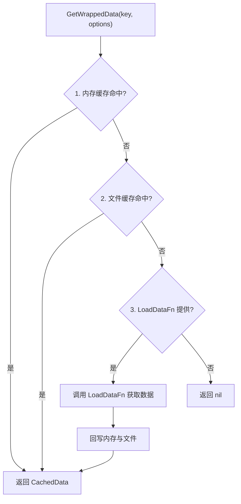
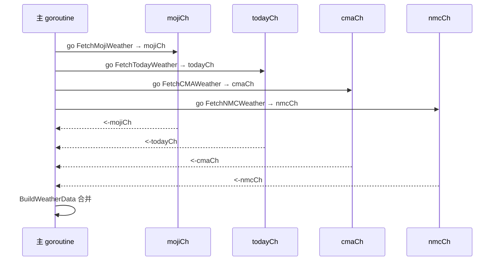
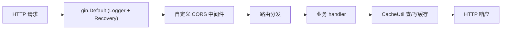
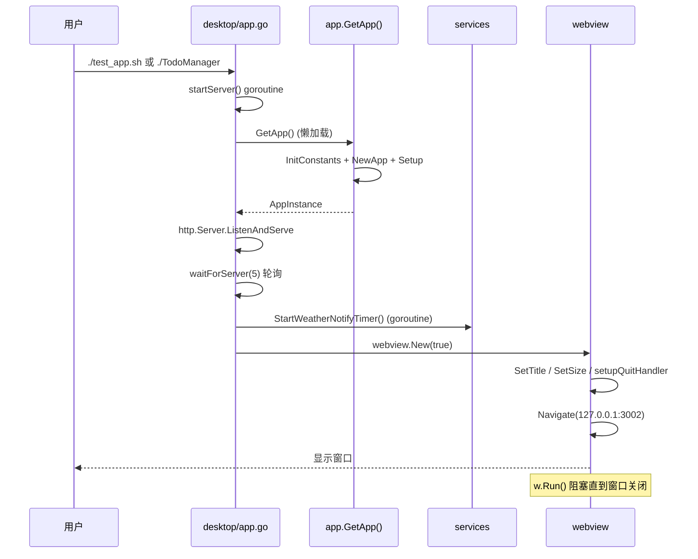
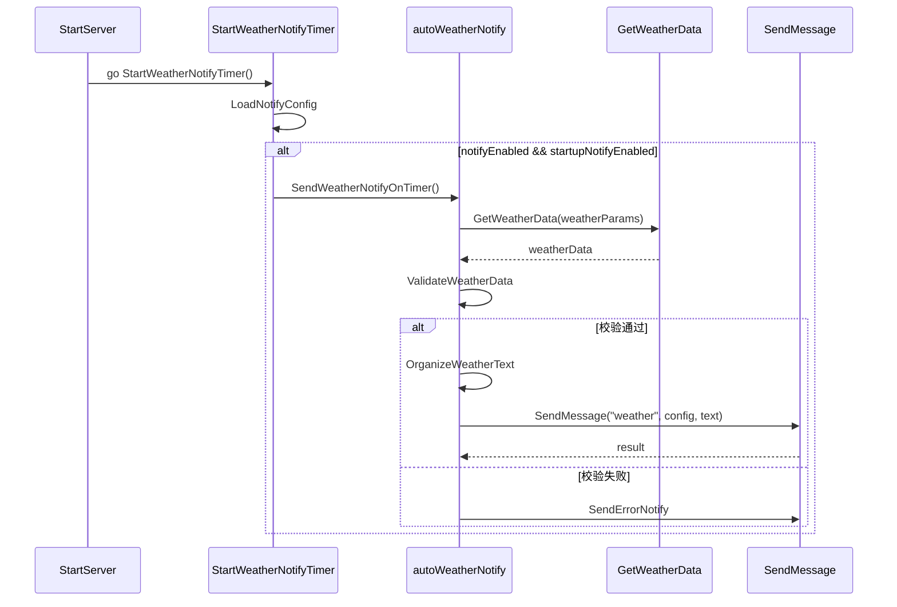

# 技术架构详解

> 生成时间：2026-08-01 ｜ 代码版本：master@d6f93a4

本文对应 C4 模型的 C2（容器）与 C3（组件）层，并梳理横切关注点。读完后应能回答：应用如何打包部署？包之间如何依赖？配置/缓存/并发/日志/平台适配如何工作？

## 1. 容器视图（C2）

Todolist-Go 是**单进程**应用，但从逻辑上可拆为三个"容器"：原生窗口、内嵌 HTTP 服务、运行期数据目录。



部署形态：

| 形态 | 入口 | 产物 | 适用场景 |
|---|---|---|---|
| 桌面应用 | [app/cmd/desktop/app.go](file:///Users/huji/work/MyProject/code_mine/gitee/todo_manager/todolist-go/app/cmd/desktop/app.go) | `TodoManager` / `TodoManager.app` / `.dmg` / `.tar.gz` / `.zip` | 默认形态，最终用户 |
| 纯 HTTP 服务 | [app/cmd/server/server.go](file:///Users/huji/work/MyProject/code_mine/gitee/todo_manager/todolist-go/app/cmd/server/server.go) | 同一可执行文件（不同 main） | 调试、无 GUI 环境 |

两种入口共用 [app.GetApp()](file:///Users/huji/work/MyProject/code_mine/gitee/todo_manager/todolist-go/app/core.go#L171) 返回的全局 `App` 实例，区别仅在是否启动 webview 窗口。

## 2. 组件视图（C3）

### 2.1 入口层（cmd/）

| 入口 | 职责 | 启动流程 | 平台适配 |
|---|---|---|---|
| [app/cmd/desktop/app.go](file:///Users/huji/work/MyProject/code_mine/gitee/todo_manager/todolist-go/app/cmd/desktop/app.go) | 启动 HTTP 服务 + 打开 webview 窗口 | `NewTodoApp().Run()`：1) `startServer()` 在 goroutine 中 `ListenAndServe`；2) `waitForServer(5)` 轮询 `/`；3) `webview.New(true)` 创建窗口；4) 注册 SIGINT/SIGTERM → `w.Terminate()`；5) `w.Run()` 阻塞 | macOS 通过 [app_darwin.go](file:///Users/huji/work/MyProject/code_mine/gitee/todo_manager/todolist-go/app/cmd/desktop/app_darwin.go) 注入"Quit"菜单（cgo + Cocoa） |
| [app/cmd/server/server.go](file:///Users/huji/work/MyProject/code_mine/gitee/todo_manager/todolist-go/app/cmd/server/server.go) | 仅启动 HTTP 服务 | `app.GetApp().StartServer()` → `Router.Run(:3002)` | 无平台适配 |

> **优雅关闭**：桌面入口通过信号触发 `w.Terminate()` 退出主循环；HTTP 服务端口的实际 `Shutdown` 在 [core.go Shutdown()](file:///Users/huji/work/MyProject/code_mine/gitee/todo_manager/todolist-go/app/core.go#L159) 中实现，但桌面入口未显式调用，依赖进程退出释放端口。`/api/shutdown` 接口通过向自己发送 `SIGINT` 触发退出（见 [status_routes.go](file:///Users/huji/work/MyProject/code_mine/gitee/todo_manager/todolist-go/app/routes/status_routes.go#L27-L36)）。

### 2.2 应用装配（app/core.go）

[App](file:///Users/huji/work/MyProject/code_mine/gitee/todo_manager/todolist-go/app/core.go#L18) 是后端的核心结构体：

```go
type App struct {
    Router    *gin.Engine
    StaticDir string
    Port      int
}
```

- **依赖装配方式**：手动装配，无 DI 框架。全局单例 `appInstance` 通过 [GetApp()](file:///Users/huji/work/MyProject/code_mine/gitee/todo_manager/todolist-go/app/core.go#L171) 懒加载，首次调用时执行 `NewApp()` + `Setup()`。
- **[Setup()](file:///Users/huji/work/MyProject/code_mine/gitee/todo_manager/todolist-go/app/core.go#L45)** 顺序：CORS 中间件 → 注册 API 路由 → 注册页面路由 → 注册静态文件路由。
- **CORS**：自定义中间件，设置 `Access-Control-Allow-Origin: *` 并处理 OPTIONS 预检（[core.go#L55-L68](file:///Users/huji/work/MyProject/code_mine/gitee/todo_manager/todolist-go/app/core.go#L55-L68)）。
- **静态文件**：`/static`、`/assets`、`/src/client/assets` 三个路径都映射到同一 `static/` 目录，是为了兼容前端不同路径引用习惯（见 [core.go#L82-L88](file:///Users/huji/work/MyProject/code_mine/gitee/todo_manager/todolist-go/app/core.go#L82-L88)）。

### 2.3 路由层（app/routes/）

[RegisterRoutes](file:///Users/huji/work/MyProject/code_mine/gitee/todo_manager/todolist-go/app/routes/routes.go#L8) 统一注册 5 个路由组：

| 路由组 | 文件 | 路由前缀 | 主要端点 |
|---|---|---|---|
| File | [file_routes.go](file:///Users/huji/work/MyProject/code_mine/gitee/todo_manager/todolist-go/app/routes/file_routes.go) | `/api/file` | `GET /scan`、`GET /read/:filename`、`POST /write/:filename` |
| Holiday | [holiday_routes.go](file:///Users/huji/work/MyProject/code_mine/gitee/todo_manager/todolist-go/app/routes/holiday_routes.go) | `/api/holiday` | `GET /cache`、`POST /refresh-cache` |
| Festival | [festival_routes.go](file:///Users/huji/work/MyProject/code_mine/gitee/todo_manager/todolist-go/app/routes/festival_routes.go) | `/api/festival` | `GET /config`、`POST /save` |
| Status | [status_routes.go](file:///Users/huji/work/MyProject/code_mine/gitee/todo_manager/todolist-go/app/routes/status_routes.go) | `/api` | `GET /check-status`、`POST /shutdown` |
| Weather | [weather_routes.go](file:///Users/huji/work/MyProject/code_mine/gitee/todo_manager/todolist-go/app/routes/weather_routes.go) | `/api/weather` | `GET /ip-location`、`GET /weather-area-codes`、`GET /weather-info` |

> 路由层模式：每个文件按"注册函数 + 业务逻辑函数 + gin handler 函数"三段式组织，handler 中先查缓存、再调逻辑、最后回写缓存（参见 [scanFiles](file:///Users/huji/work/MyProject/code_mine/gitee/todo_manager/todolist-go/app/routes/file_routes.go#L58)）。

### 2.4 服务层（app/services/）

| 文件 | 职责 | 关键导出 |
|---|---|---|
| [location_service.go](file:///Users/huji/work/MyProject/code_mine/gitee/todo_manager/todolist-go/app/services/location_service.go) | IP 定位、区县编码匹配 | `GetLocation`、`GetAllAreaCodes`、`GetDistrictAreaCodes`、`FindDistrictInfo` |
| [weather_service.go](file:///Users/huji/work/MyProject/code_mine/gitee/todo_manager/todolist-go/app/services/weather_service.go) | 多源天气数据聚合与缓存 | `GetWeatherData`、`QueryWeatherData`、`BuildWeatherData`、`CacheWeatherInfo` |
| [notify_service.go](file:///Users/huji/work/MyProject/code_mine/gitee/todo_manager/todolist-go/app/services/notify_service.go) | 短信（Messages.app）+ 微信客服消息 | `SendMessage`、`SendSMSMessage`、`SendWechatMessage`、`GetWechatAccessToken` |
| [auto_weather_notify_service.go](file:///Users/huji/work/MyProject/code_mine/gitee/todo_manager/todolist-go/app/services/auto_weather_notify_service.go) | 定时通知编排、天气文本组织 | `StartWeatherNotifyTimer`、`RunSendTask` |
| [weather/](file:///Users/huji/work/MyProject/code_mine/gitee/todo_manager/todolist-go/app/services/weather) | 4 个天气数据源适配器 | `FetchMojiWeather`、`FetchCMAWeather`、`FetchNMCWeather`、`FetchTodayWeather` 等 |

### 2.5 工具层（app/utils/）

| 文件 | 职责 | 全局单例 |
|---|---|---|
| [config_util.go](file:///Users/huji/work/MyProject/code_mine/gitee/todo_manager/todolist-go/app/utils/config_util.go) | 配置文件读写、目录管理、超时配置 | `ConfigUtilInstance` |
| [cache_util.go](file:///Users/huji/work/MyProject/code_mine/gitee/todo_manager/todolist-go/app/utils/cache_util.go) | 三级缓存（内存/文件/加载器） | `CacheUtilInstance` |
| [logger_util.go](file:///Users/huji/work/MyProject/code_mine/gitee/todo_manager/todolist-go/app/utils/logger_util.go) | slog 结构化日志，动态级别 | `LoggerInstance` |
| [constants.go](file:///Users/huji/work/MyProject/code_mine/gitee/todo_manager/todolist-go/app/utils/constants.go) | 全局开关与默认位置 | `InitConstants()` |

### 2.6 包依赖关系



要点：

- 依赖方向单向向下：`cmd → app → {routes, services, utils}`，`routes → services`，`services → utils`，无循环依赖。
- `routes` 直接依赖 `utils`（缓存、配置），未经过 `services` 抽象——这是为了与 Python 版对齐的轻量设计，新增业务可考虑统一走 `services`。
- `weather` 子包只依赖 `utils`，不反向依赖 `services`，便于独立测试与替换。

## 3. 横切关注点

### 3.1 配置管理

**配置来源**：3 个 JSON 文件，位于 `data/config/`，由 [ConfigUtil](file:///Users/huji/work/MyProject/code_mine/gitee/todo_manager/todolist-go/app/utils/config_util.go#L14) 管理：

| 配置名 | 文件 | 用途 |
|---|---|---|
| `app` | [app_config.json](file:///Users/huji/work/MyProject/code_mine/gitee/todo_manager/todolist-go/data/config/app_config.json) | 端口、超时、特性开关、默认位置、日志开关 |
| `notify` | [notify_config.json](file:///Users/huji/work/MyProject/code_mine/gitee/todo_manager/todolist-go/data/config/notify_config.json) | 天气通知（手机号/微信 OpenID/AppID/Secret/定时） |
| `festival` | [festival_config.json](file:///Users/huji/work/MyProject/code_mine/gitee/todo_manager/todolist-go/data/config/festival_config.json) | 用户自定义节日列表 |

**机制**：

- **目录解析**：[getProjectRoot()](file:///Users/huji/work/MyProject/code_mine/gitee/todo_manager/todolist-go/app/utils/config_util.go#L53) 优先按可执行文件路径检测 `.app/Contents/MacOS`，命中则返回 `Contents/Resources`；否则向上查找 `go.mod` 定位项目根。这保证了 .app 包内可正确找到 `data/`。
- **内存缓存**：`configCache` + `sync.RWMutex`，首次读取后缓存，[SaveConfig](file:///Users/huji/work/MyProject/code_mine/gitee/todo_manager/todolist-go/app/utils/config_util.go#L158) 写入时同步更新缓存。
- **路径取值**：[GetConfigValue](file:///Users/huji/work/MyProject/code_mine/gitee/todo_manager/todolist-go/app/utils/config_util.go#L180) 支持 `a.b.c` 点分路径。
- **无热更新**：配置变更需调用 `SaveConfig` 或重启进程；外部修改文件不会自动反映到内存缓存。
- **全局开关**：[InitConstants()](file:///Users/huji/work/MyProject/code_mine/gitee/todo_manager/todolist-go/app/utils/constants.go#L26) 从 `app` 配置读取 `USE_MOCK` / `USE_CACHE` / `PRINT_API_DATA` / `PRINT_DATA_LOG` / `DefaultLocation`，必须在 `ConfigUtilInstance` 初始化后调用（[GetApp()](file:///Users/huji/work/MyProject/code_mine/gitee/todo_manager/todolist-go/app/core.go#L171-L178) 中保证）。

### 3.2 缓存机制

[CacheUtil](file:///Users/huji/work/MyProject/code_mine/gitee/todo_manager/todolist-go/app/utils/cache_util.go#L38) 是项目最核心的工具之一，采用**三级回源**模型：



**关键设计**：

- **CacheOptions** 字段：`AllowExpired`（允许返回过期数据作兜底）、`SourceFile`（指定源文件而非默认缓存文件）、`Permanent`（永久缓存，不写文件）、`LoadDataFn`（自定义回源函数）、`TTL`（毫秒）。
- **缓存键安全化**：[getSafeKey](file:///Users/huji/work/MyProject/code_mine/gitee/todo_manager/todolist-go/app/utils/cache_util.go#L117) 用正则把非 `[a-zA-Z0-9_-]` 字符替换为 `_`，避免文件名非法。
- **文件存储**：默认存 `data/cache/<safe_key>.json`，结构为 `MemoryCacheItem`（含 data/timestamp/ttl/permanent）。
- **SourceFile 模式**：当数据本身有独立文件（如 `merged_weather_area_codes.json`、`mock_weather_info.json`），直接从该文件读，避免重复存储。
- **全局开关**：`USE_CACHE=false` 时 `GetWrappedData` 直接返回 nil，所有缓存逻辑短路（[cache_util.go#L277](file:///Users/huji/work/MyProject/code_mine/gitee/todo_manager/todolist-go/app/utils/cache_util.go#L277)）。
- **并发注意**：当前 `memoryCache` 是普通 `map`，**未加锁**。多 goroutine 并发读写存在数据竞争风险，已在 [ADR-0005](05-adr/0005-缓存并发安全权衡.md) 记录。

**各业务的缓存策略**：

| 业务 | key | TTL | AllowExpired | SourceFile | LoadDataFn |
|---|---|---|---|---|---|
| 文件列表 | `file_list` | 300000ms (5min) | false | - | - |
| 文件内容 | `file_read_<name>` | 300000ms | false | - | - |
| 节假日 | `holiday_cache` | 100天 | true | `data/cache/holiday_cache.json` | `fetchHolidayData` |
| 节日配置 | `festival_config` | 默认 1h | - | - | - |
| IP 位置 | `ip_<ip>` | 1h | true | - | - |
| 天气数据 | `weather_<code>_<moji>` | 1h | true | - | - |
| 区县编码 | `merged_weather_area_codes` | 永久 | - | `data/weather/merged_weather_area_codes.json` | - |
| 微信 token | `wechat_access_token` | expires_in*1000ms | - | - | - |

### 3.3 并发模型

项目使用 goroutine + channel + sync 原语的轻量并发，**无 worker pool / 限流**。

**典型模式 1：fan-out + channel 收集**（[QueryWeatherData](file:///Users/huji/work/MyProject/code_mine/gitee/todo_manager/todolist-go/app/services/weather_service.go#L326-L433)）

7 个天气源并行请求，每个 goroutine 向独立 buffered channel（容量 1）写入结果，主 goroutine 顺序读取。这是典型的"扇出-收集"模式，buffered channel 防止 goroutine 阻塞。



**典型模式 2：sync.WaitGroup**（[GetCurrLocation](file:///Users/huji/work/MyProject/code_mine/gitee/todo_manager/todolist-go/app/services/location_service.go#L171-L177)）两个位置源并行，`wg.Wait()` 等待两个都返回。

**典型模式 3：sync.Once 单例**（[getCMAHTTPClient](file:///Users/huji/work/MyProject/code_mine/gitee/todo_manager/todolist-go/app/services/weather/weather_cma_service.go#L33-L57)）复用带 uTLS 的 http.Client，避免每次请求重新握手。

**典型模式 4：后台 goroutine**（[StartServer](file:///Users/huji/work/MyProject/code_mine/gitee/todo_manager/todolist-go/app/core.go#L144)、[startServer](file:///Users/huji/work/MyProject/code_mine/gitee/todo_manager/todolist-go/app/cmd/desktop/app.go#L57)、[shutdown](file:///Users/huji/work/MyProject/code_mine/gitee/todo_manager/todolist-go/app/routes/status_routes.go#L31)、[信号处理](file:///Users/huji/work/MyProject/code_mine/gitee/todo_manager/todolist-go/app/cmd/desktop/app.go#L116-L120)）。

**Context 传播**：当前**未在业务链路中使用 context.Context 传递超时/取消**。超时通过 `http.Client.Timeout` 控制（[ConfigUtil.GetLocationAPITimeoutDuration](file:///Users/huji/work/MyProject/code_mine/gitee/todo_manager/todolist-go/app/utils/config_util.go#L258) 等配置）。`weather_cma_service.go` 的 `DialTLSContext` 接收 context 但由 net/http 内部传入，业务层未主动 `WithTimeout`。

### 3.4 日志与可观测性

- **实现**：[Logger](file:///Users/huji/work/MyProject/code_mine/gitee/todo_manager/todolist-go/app/utils/logger_util.go#L15) 包装 `log/slog`，输出到 `data/logs/app.log` + stdout（[MultiWriter](file:///Users/huji/work/MyProject/code_mine/gitee/todo_manager/todolist-go/app/utils/logger_util.go#L51)）。
- **格式**：Text handler，`AddSource: true` 输出调用位置。
- **动态级别**：[GlobalLevel](file:///Users/huji/work/MyProject/code_mine/gitee/todo_manager/todolist-go/app/utils/logger_util.go#L23) 是 `*slog.LevelVar`，运行时可调整。
- **行号修正**：[log()](file:///Users/huji/work/MyProject/code_mine/gitee/todo_manager/todolist-go/app/utils/logger_util.go#L70-L87) 用 `runtime.Callers(3, ...)` 跳过封装层，确保打印的是业务调用方行号。
- **性能优化**：先 `logger.Enabled` 检查级别再构造 Record；[argsToAttrs](file:///Users/huji/work/MyProject/code_mine/gitee/todo_manager/todolist-go/app/utils/logger_util.go#L120) 减少 escape。
- **API 调试开关**：`PRINT_API_DATA` / `PRINT_DATA_LOG` 开启时打印完整请求/响应 JSON（[weather_service.go#L245-L280](file:///Users/huji/work/MyProject/code_mine/gitee/todo_manager/todolist-go/app/services/weather_service.go#L245-L280)）。
- **无 trace ID / metrics**：当前无链路追踪与指标采集。

### 3.5 错误处理策略

项目采用**轻量错误处理**，未定义自定义 error 类型与错误码体系：

- **错误包装**：少量使用 `fmt.Errorf("...: %v", err)`（如 [fetchHolidayData](file:///Users/huji/work/MyProject/code_mine/gitee/todo_manager/todolist-go/app/routes/holiday_routes.go#L42)），**未使用 `%w` 包裹**，因此上层无法 `errors.Is/As`。
- ** sentinel 式返回**：函数返回 `map[string]interface{}` 时用 `"error"` key 携带错误信息（如 [FetchCMAWeather](file:///Users/huji/work/MyProject/code_mine/gitee/todo_manager/todolist-go/app/services/weather/weather_cma_service.go#L61) 返回 `{"error": {...}}`）。
- **聚合错误**：[checkWeatherError](file:///Users/huji/work/MyProject/code_mine/gitee/todo_manager/todolist-go/app/services/weather_service.go#L436) 收集多个源的错误为字符串切片，仅 warn 日志，不中断流程。
- **HTTP 状态码映射**：handler 中手写 `c.JSON(http.StatusXxx, ...)`，无统一中间件。
- **recover**：仅在 mock 数据读取处用 `defer recover()` 兜底（[GetWeatherData](file:///Users/huji/work/MyProject/code_mine/gitee/todo_manager/todolist-go/app/services/weather_service.go#L468-L472)）。
- **类型断言安全**：大量使用 `m, _ := x.(map[string]interface{})` 模式静默忽略类型不匹配。

> 详见 [ADR-0006 错误处理策略选型](05-adr/0006-错误处理策略选型.md)。

### 3.6 中间件链

[Setup()](file:///Users/huji/work/MyProject/code_mine/gitee/todo_manager/todolist-go/app/core.go#L45-L92) 中仅注册一个全局中间件（CORS），无日志/恢复/限流等常见中间件——`gin.Default()` 已自带 Logger 与 Recovery。



### 3.7 平台适配

| 维度 | 实现 | 文件 |
|---|---|---|
| Build tag | `//go:build darwin` | [app/cmd/desktop/app_darwin.go](file:///Users/huji/work/MyProject/code_mine/gitee/todo_manager/todolist-go/app/cmd/desktop/app_darwin.go) |
| cgo | `#cgo CFLAGS: -x objective-c` + `#cgo LDFLAGS: -framework Cocoa` | 同上 |
| 平台特定能力 | macOS 退出菜单（NSApplication + Quit 菜单项） | [setupQuitMenu](file:///Users/huji/work/MyProject/code_mine/gitee/todo_manager/todolist-go/app/cmd/desktop/app_darwin.go#L8-L24) |
| 默认实现 | 非 macOS 平台 `setupQuitHandler = noop` | [app/cmd/desktop/app.go#L21-L25](file:///Users/huji/work/MyProject/code_mine/gitee/todo_manager/todolist-go/app/cmd/desktop/app.go#L21-L25) |
| 短信通知 | 仅 macOS（依赖 `osascript` + Messages.app） | [SendSMSMessage](file:///Users/huji/work/MyProject/code_mine/gitee/todo_manager/todolist-go/app/services/notify_service.go#L123) |
| 交叉编译 | `GOOS/GOARCH` 环境变量，`-ldflags "-s -w"` | [build.sh#L80-L96](file:///Users/huji/work/MyProject/code_mine/gitee/todo_manager/todolist-go/build.sh#L80-L96) |
| .app 打包 | 复制可执行文件 + static + data 到 `Contents/Resources/`，生成 Info.plist | [create_macos_app_bundle](file:///Users/huji/work/MyProject/code_mine/gitee/todo_manager/todolist-go/build.sh#L121-L194) |

> **cgo 依赖提示**：`app_darwin.go` 使用 cgo 调用 Cocoa，因此 macOS 构建需要 Xcode/clang 工具链；Linux/Windows 桌面构建依赖各自的 webview 系统库（WebKitGTK / WebView2），详见 [07-dev-guide.md](07-dev-guide.md)。

### 3.8 资源嵌入

当前**未使用 `//go:embed`**，`static/` 与 `data/` 通过文件系统读取。.app 打包时由 `build.sh` 复制到 `Contents/Resources/`。这意味着：

- 优点：用户可修改配置与前端文件而无需重新编译。
- 缺点：分发时必须携带 `static/` 与 `data/` 目录，单可执行文件不可运行。

> 若未来希望生成单文件可执行，可考虑 `//go:embed static/* data/config/* data/weather/*`，但会牺牲运行期可编辑性。

## 4. 关键调用链路（C4 代码视图）

### 4.1 桌面应用启动



### 4.2 天气查询（多源聚合）

详见 [03-business-architecture.md §3.1](03-business-architecture.md) 的完整时序图。

### 4.3 定时天气通知



> 注：当前实现中 `StartWeatherNotifyTimer` 仅在启动时执行一次即时通知（若 `startupNotifyEnabled=true`），**未真正实现 cron 定时调度**——`cronExpression` 仅用于日志展示（见 [auto_weather_notify_service.go#L241-L249](file:///Users/huji/work/MyProject/code_mine/gitee/todo_manager/todolist-go/app/services/auto_weather_notify_service.go#L241-L249)）。这是一个已知的功能差距，记录在 [08-faq.md](08-faq.md)。
