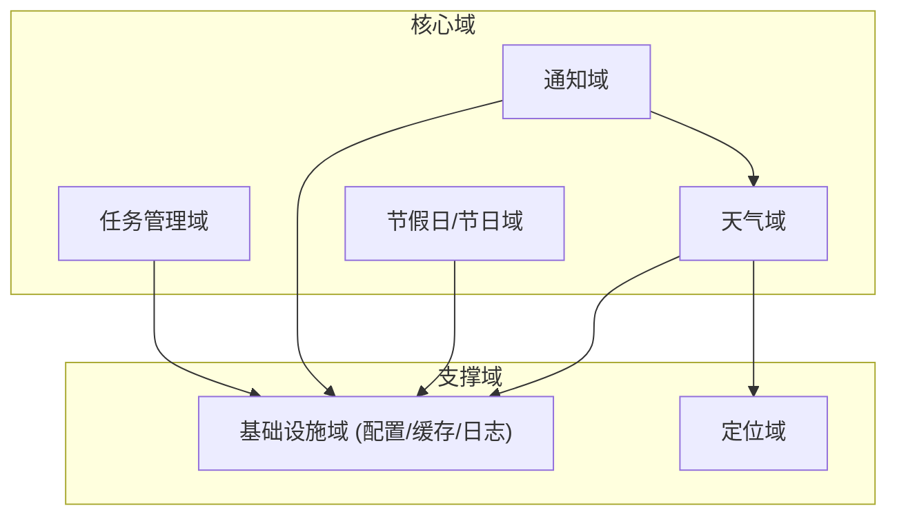
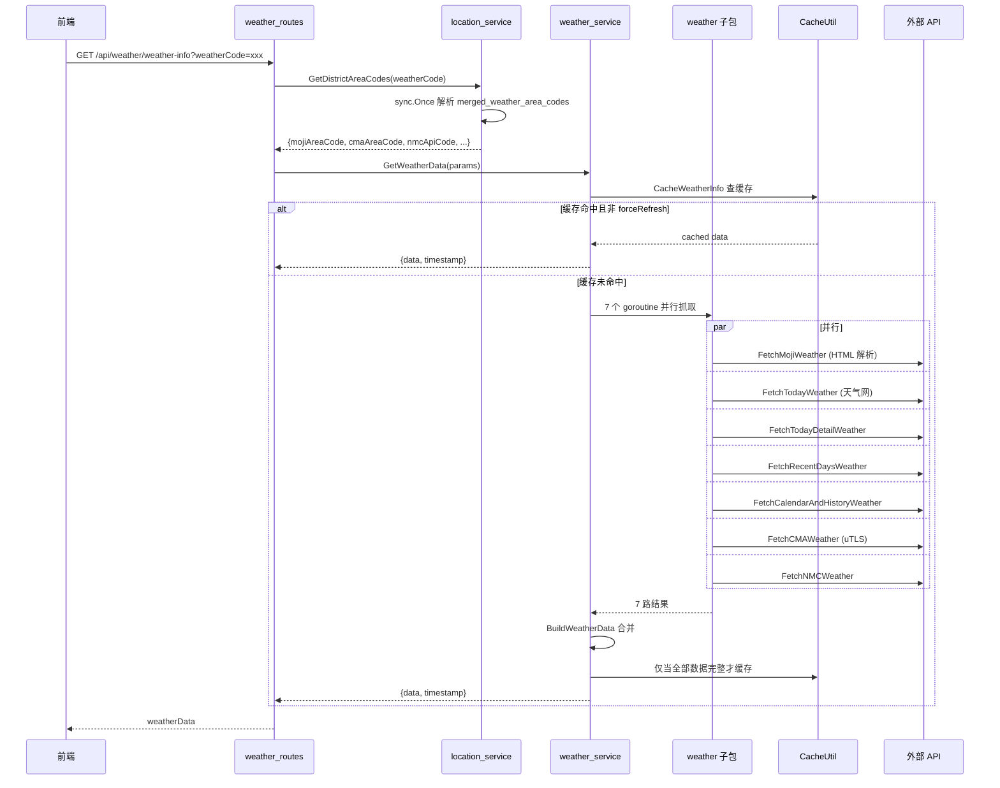
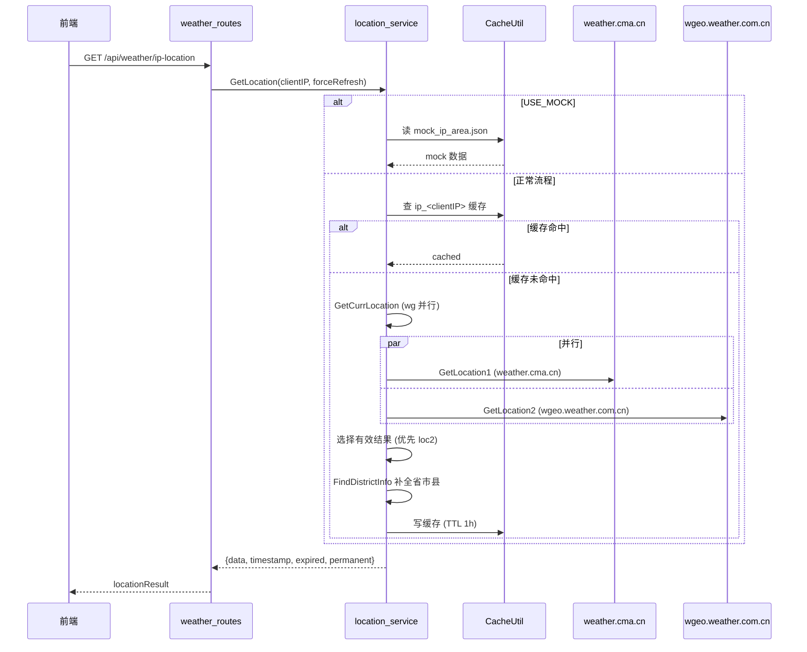
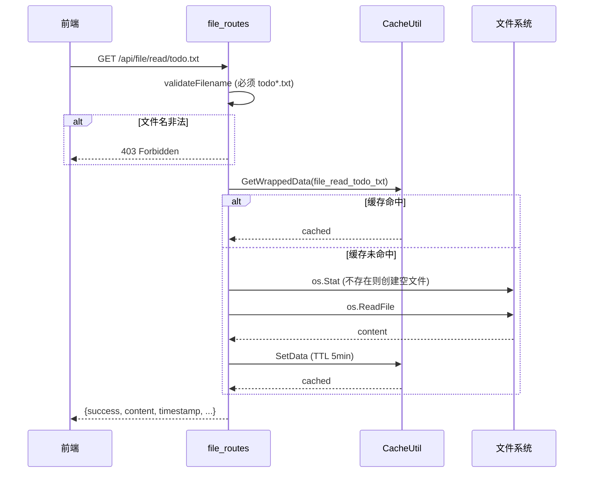
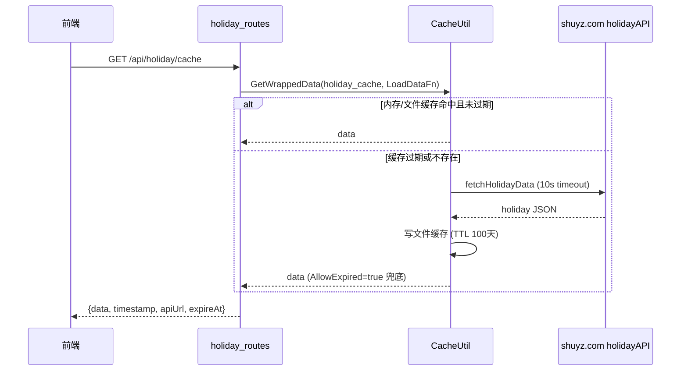
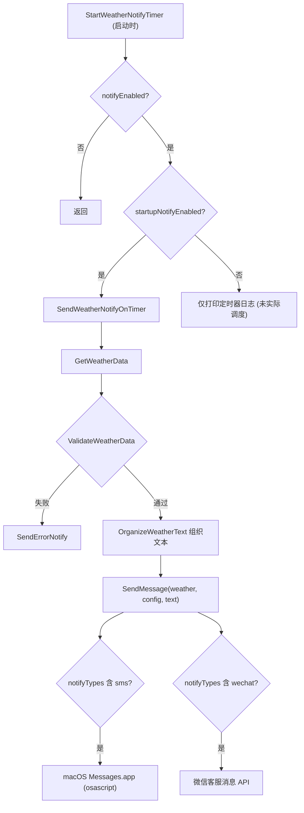
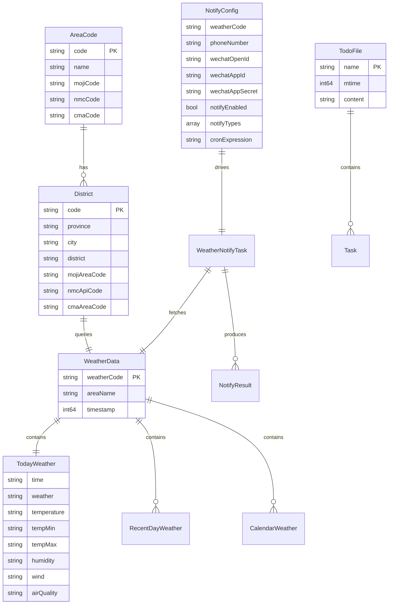

# 业务架构详解

> 生成时间：2026-08-01 ｜ 代码版本：master@d6f93a4

## 1. 业务域划分

Todolist-Go 围绕"个人桌面待办"展开，业务域可分为 4 个核心域 + 2 个支撑域：

| 域 | 后端包 | 关键能力 | 依赖 |
|---|---|---|---|
| 任务管理 | [routes/file_routes.go](file:///Users/huji/work/MyProject/code_mine/gitee/todo_manager/todolist-go/app/routes/file_routes.go) | 扫描/读取/写入 `todo*.txt` 文件 | 基础设施 |
| 天气查询 | [services/weather_service.go](file:///Users/huji/work/MyProject/code_mine/gitee/todo_manager/todolist-go/app/services/weather_service.go) + [services/weather/](file:///Users/huji/work/MyProject/code_mine/gitee/todo_manager/todolist-go/app/services/weather) | 多源聚合（4 个数据源）+ 缓存 | 定位、基础设施 |
| 节假日/节日 | [routes/holiday_routes.go](file:///Users/huji/work/MyProject/code_mine/gitee/todo_manager/todolist-go/app/routes/holiday_routes.go) + [routes/festival_routes.go](file:///Users/huji/work/MyProject/code_mine/gitee/todo_manager/todolist-go/app/routes/festival_routes.go) | 节假日抓取与缓存；用户自定义节日配置 | 基础设施 |
| 通知 | [services/notify_service.go](file:///Users/huji/work/MyProject/code_mine/gitee/todo_manager/todolist-go/app/services/notify_service.go) + [services/auto_weather_notify_service.go](file:///Users/huji/work/MyProject/code_mine/gitee/todo_manager/todolist-go/app/services/auto_weather_notify_service.go) | 短信 + 微信客服消息；定时编排 | 天气、基础设施 |
| 定位 | [services/location_service.go](file:///Users/huji/work/MyProject/code_mine/gitee/todo_manager/todolist-go/app/services/location_service.go) | IP 定位 + 区县编码匹配 | 基础设施 |
| 基础设施 | [utils/](file:///Users/huji/work/MyProject/code_mine/gitee/todo_manager/todolist-go/app/utils) | 配置 / 三级缓存 / 日志 / 常量 | - |

## 2. 包职责矩阵

| 包路径 | 职责 | 不负责 | 依赖 | 被依赖 |
|---|---|---|---|---|
| `app` ([core.go](file:///Users/huji/work/MyProject/code_mine/gitee/todo_manager/todolist-go/app/core.go)) | 应用装配、路由/静态文件注册、启动 HTTP 与定时通知 | 业务逻辑、平台 GUI | routes, services, utils, gin | cmd/desktop, cmd/server |
| `app/cmd/desktop` | 启动 HTTP + 创建 webview 窗口、信号处理 | 业务逻辑 | app, webview_go | （入口） |
| `app/cmd/server` | 启动纯 HTTP 服务 | 业务逻辑、GUI | app | （入口） |
| `app/routes` | HTTP 端点定义、请求/响应序列化、缓存编排 | 外部 API 调用（除 holiday 外）、复杂业务规则 | services, utils, gin | app |
| `app/services` | 业务规则、外部 API 调用、数据聚合 | HTTP 协议、文件系统细节 | services/weather, utils | routes, app |
| `app/services/weather` | 4 个天气数据源的抓取与解析 | 缓存策略、聚合规则 | utils, goquery, utls | services |
| `app/utils` | 配置、缓存、日志、全局开关 | 业务规则 | stdlib, slog | 所有上层包 |

## 3. 核心业务流程

### 3.1 天气查询链路（多源聚合）

这是项目最复杂的流程：用户请求 → 区县编码映射 → 4 个数据源并行抓取 → 合并取最新 → 缓存 → 返回。

**合并策略要点**（[BuildWeatherData](file:///Users/huji/work/MyProject/code_mine/gitee/todo_manager/todolist-go/app/services/weather_service.go#L78-L323)）：

1. **今日天气**：从所有源的 `liveWeather` 中按 `time` 字段降序排序，取更新最晚的源作为主数据，再合并其他源的非空字段。
2. **逐小时/生活助手**：仅取天气网（todayWeatherData）的 `hourlyWeather` 与 `lifeHelper`。
3. **近几日天气**：优先取天气网 `recentDaysWeather`，回退到 NMC 的 `dailyWeather`。
4. **日历天气**：取天气网 `calendarWeather`，并用墨迹的 `calendarWeather` 补齐**历史日期**（今日之前）的字段。
5. **缓存条件**：仅当 8 项数据（moji/today/live/hourly/life/detail/recent/calendar）**全部非空**才写入缓存（[weather_service.go#L315-L318](file:///Users/huji/work/MyProject/code_mine/gitee/todo_manager/todolist-go/app/services/weather_service.go#L315-L318)），避免缓存不完整数据。

### 3.2 IP 定位流程

**位置源选择策略**（[GetCurrLocation](file:///Users/huji/work/MyProject/code_mine/gitee/todo_manager/todolist-go/app/services/location_service.go#L171-L231)）：

- `forceRefresh=true`：优先用 CMA（loc1），失败则用天气网（loc2）。
- `forceRefresh=false`：优先用天气网（loc2），失败回退 CMA。
- 两者都失败：使用 [DefaultLocation](file:///Users/huji/work/MyProject/code_mine/gitee/todo_manager/todolist-go/app/utils/constants.go#L13)（默认杭州）。
- 最后用 `FindDistrictInfo` 在 `merged_weather_area_codes.json` 中递归查找，补全标准的省/市/县/code。

### 3.3 任务文件读写流程

**安全约束**：

- [validateFilename](file:///Users/huji/work/MyProject/code_mine/gitee/todo_manager/todolist-go/app/routes/file_routes.go#L88-L90) 强制文件名前缀 `todo` + 后缀 `.txt`，防止路径穿越。
- [writeFile](file:///Users/huji/work/MyProject/code_mine/gitee/todo_manager/todolist-go/app/routes/file_routes.go#L123-L144) 写入后调用 [clearFileCache](file:///Users/huji/work/MyProject/code_mine/gitee/todo_manager/todolist-go/app/routes/file_routes.go#L93-L98) 失效该文件与文件列表缓存。

### 3.4 节假日抓取与缓存

**特点**：

- TTL 100 天（[holidayTTL](file:///Users/huji/work/MyProject/code_mine/gitee/todo_manager/todolist-go/app/routes/holiday_routes.go#L20)），允许使用过期缓存作兜底（`AllowExpired: true`）。
- 源文件持久化在 `data/cache/holiday_cache.json`，重启后仍可用。
- `POST /refresh-cache` 可清空缓存并重新抓取，支持自定义 API URL。

### 3.5 天气通知流程

通知域的核心是 [AutoWeatherNotify](file:///Users/huji/work/MyProject/code_mine/gitee/todo_manager/todolist-go/app/services/auto_weather_notify_service.go#L13)，它编排"获取天气 → 组织文本 → 发送通知"：

**文本组织**（[OrganizeWeatherText](file:///Users/huji/work/MyProject/code_mine/gitee/todo_manager/todolist-go/app/services/auto_weather_notify_service.go#L73-L128)）：

- 第一行：📍 地区 + 📅 日期时间（带星期）
- 今日：天气图标 + 天气 + 温度区间 + 湿度 + 空气质量 + 风力
- 未来：逐日预告（图标 + 天气 + 温度 + 风力 + 星期）
- 链接：天气网 / 墨迹 / 中央气象台 / 中国气象局 详情页
- 落款：祝您生活愉快

**图标映射**（[WeatherIcons](file:///Users/huji/work/MyProject/code_mine/gitee/todo_manager/todolist-go/app/services/auto_weather_notify_service.go#L22-L33)）：按关键词匹配，雨/雷/雾/雪/晴/阴/云各有专属 emoji。

## 4. 核心业务实体关系

后端未定义结构体领域模型，数据以 `map[string]interface{}` 流转。下图展示**逻辑实体**关系（基于字段使用归纳）：

## 5. 接口分类

### 5.1 REST API

完整端点见 [01-overview.md §技术栈](01-overview.md) 与 [02-tech-architecture.md §2.3](02-tech-architecture.md)。响应统一格式为 `{success/data, timestamp, error/expired/permanent}` 的灵活组合（无强类型契约）。

### 5.2 前端模块 API

前端为静态 JS，按业务域组织在 `static/js/business/`：

| 模块 | 职责 |
|---|---|
| `common/base.js` | 通用工具、API 调用封装 |
| `common/holiday_manager.js` | 节假日前端管理 |
| `common/lunar_utils.js` | 农历计算（依赖 `third_party/lunar.js`） |
| `todo/task_parser.js` | `todo.txt` 格式解析 |
| `todo/task_operations.js` | 任务增删改 |
| `todo/task_list_renderer.js` | 任务列表渲染 |
| `todo/calendar_renderer.js` | 日历视图渲染 |
| `weather/location_handler.js` | 位置选择交互 |
| `weather/weather_renderer.js` | 天气展示渲染 |
| `todo_manager.js` / `calendar_view.js` / `weather_view.js` / `festival_manager.js` | 各页面入口脚本 |

> 前端不在本次架构文档的深入范围，仅记录其与后端的契约边界。前端通过相对路径 `/api/...` 调用后端，无独立 SDK。

### 5.3 配置文件契约

| 文件 | schema 来源 | 修改方式 |
|---|---|---|
| [app_config.json](file:///Users/huji/work/MyProject/code_mine/gitee/todo_manager/todolist-go/data/config/app_config.json) | 由 [constants.go](file:///Users/huji/work/MyProject/code_mine/gitee/todo_manager/todolist-go/app/utils/constants.go) 与 [config_util.go](file:///Users/huji/work/MyProject/code_mine/gitee/todo_manager/todolist-go/app/utils/config_util.go) 读取的固定 key | 手动编辑 |
| [notify_config.json](file:///Users/huji/work/MyProject/code_mine/gitee/todo_manager/todolist-go/data/config/notify_config.json) | 由 [notify_service.go](file:///Users/huji/work/MyProject/code_mine/gitee/todo_manager/todolist-go/app/services/notify_service.go) 与 [auto_weather_notify_service.go](file:///Users/huji/work/MyProject/code_mine/gitee/todo_manager/todolist-go/app/services/auto_weather_notify_service.go) 读取 | 手动编辑 |
| [festival_config.json](file:///Users/huji/work/MyProject/code_mine/gitee/todo_manager/todolist-go/data/config/festival_config.json) | 由前端 festival_manager 通过 `/api/festival/save` 写入 | 前端 UI 或手动编辑 |

### 5.4 数据文件契约

| 文件 | 用途 | 生成方式 |
|---|---|---|
| `data/todo.txt` / `todo.test.txt` | 任务文件 | 用户通过 UI 写入 |
| `data/cache/*.json` | 缓存文件 | 后端自动写入 |
| `data/weather/merged_weather_area_codes.json` | 区县编码主数据 | 由 `data/data_scripts/merge_all_weather_codes.py` 离线生成 |
| `data/weather/{cma,moji,nmc,tianqi}_*.json` | 各源原始编码数据 | 由 `data/data_scripts/fetch_*_area_codes.py` 抓取 |
| `data/mock/*.json` | Mock 数据 | 手动准备，`USE_MOCK=true` 时启用 |
