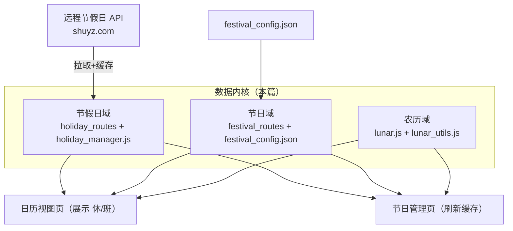
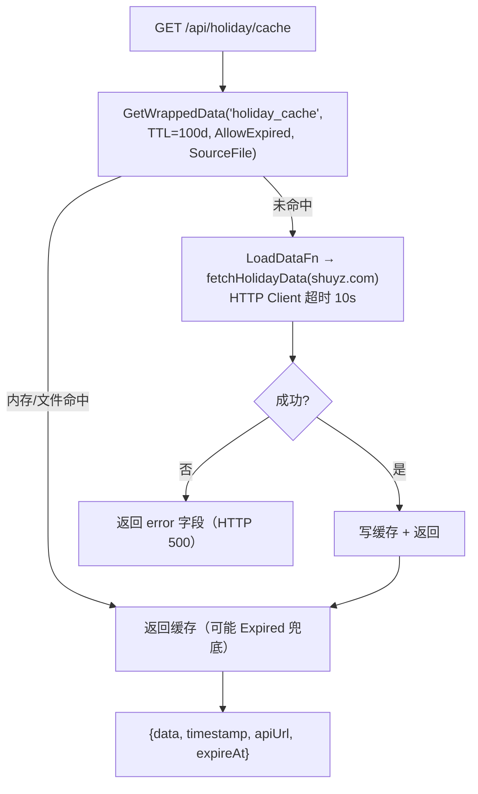

# 独立业务：节假日与节日数据域（holiday-festival）

> 生成时间：2026-09-10 ｜ 代码版本：master@40a4f33 ｜ 应用版本：v1.0.2

## 为什么单列一篇

「节假日 + 节日 + 农历」是一套**被两个页面共享、且自身无法归入任一页面**的业务能力：[日历视图页](../02-pages/calendar.md) 消费它做展示，[节日管理页](../02-pages/festival.md) 维护它做配置。它有自己的数据获取、缓存与判定规则，因此把「数据从哪来、怎么缓存、怎么判定 休/班、农历怎么算」这套**共享内核**独立成文；两个页面文档则各自聚焦「怎么用这份数据」。

- 前端共享模块：[common/holiday_manager.js](../../../static/js/business/common/holiday_manager.js)、[common/lunar_utils.js](../../../static/js/business/common/lunar_utils.js)、[third_party/lunar.js](../../../static/js/third_party/lunar.js)
- 后端：[holiday_routes.go](../../../app/routes/holiday_routes.go)、[festival_routes.go](../../../app/routes/festival_routes.go)
- 数据：`festival_config.json`、节假日缓存 `holiday_cache`

## 1. 三条数据流概览

| 子域 | 数据源 | 后端接口 | 缓存 | 计算位置 |
|---|---|---|---|---|
| 法定节假日 | 远程 API（默认 shuyz.com） | `/api/holiday/cache`、`/api/holiday/refresh-cache` | `holiday_cache`（TTL 100 天，AllowExpired） | 后端拉取，前端判定 |
| 自定义节日 | 本地 `festival_config.json` | `/api/festival/config`、`/api/festival/save` | 配置内存缓存 + `festival_config` key | 后端存取，前端匹配 |
| 农历/节气 | 无（本地算法） | 无 | 无 | 纯前端 `lunar.js` |



## 2. 节假日子域

**取数与缓存**（[getHolidayData](../../../app/routes/holiday_routes.go#L68-L101)）：走 CacheUtil 的 `LoadDataFn` 模式——命中即用（含过期兜底），缺失才回源远程 API 并落盘 `data/cache/holiday_cache.json`。



**刷新**：`/api/holiday/refresh-cache` 先 `Delete("holiday_cache")` 再走同一 `getHolidayData`，`apiUrl` 可由前端覆盖（默认为内置地址）。

**休/班判定**：前端 `holidayManager.getDateType(date)` 基于节假日数据把某天归类为 假期 / 调休上班 / 普通日，供日历着色。

## 3. 节日子域

**读**：`/api/festival/config` → `ConfigUtil.GetConfig("festival")`，非空返回 `{data:config}`，空则 404。

**写**（[saveFestivalConfig](../../../app/routes/festival_routes.go#L33-L75)）：绑定整个 JSON → 校验 `festivals` 字段必须为数组 → `SaveConfig` 落盘并更新配置内存缓存 → `Delete("festival_config")` 清另一套缓存 key。**全量覆盖**式写回。

节日条目结构（前端表单定义、后端仅结构校验）：

```json
{
  "festivals": [
    { "name": "示例", "date": "2026-01-01", "type": "农历|公历", "dateType": "...", "remark": "..." }
  ]
}
```

## 4. 农历子域

纯前端：`lunar.js` 提供公历⇄农历、干支、节气换算；`lunar_utils.js` 封装 `getLunarDateText()`（农历日文本）、`getFestivalsSync()`（合并公历/农历节日命中）、`getFestivalTypeClass()`（节日配色）。公历节日直接比对月日，农历节日需先转农历再匹配（含闰月边界）。

## 5. 与两个页面的关系

| 页面 | 用这三条子域做什么 | 详见 |
|---|---|---|
| [日历视图](../02-pages/calendar.md) | 三域数据合成整月日历（休/班着色、农历、节日名） | 页面 §3–4 |
| [节日管理](../02-pages/festival.md) | 编辑节日、切换节假日 API 源、刷新缓存 | 页面 §3–4 |
| [任务管理器](../02-pages/todo.md) | 启动时 `initFestivals()` 读取节日用于展示 | 页面 §2 |

三页均在各自 iframe 上下文，`window.holidayManager`/`window.lunarUtils` **不跨页共享**，一致性全部依赖本篇描述的后端缓存与文件。

## 6. 技术要点与已知问题

- **缓存新鲜度**：节假日 100 天 TTL + 过期兜底，调休安排更新后可能显示过时；靠节日页「刷新缓存」强制回源。
- **双缓存 key 陷阱**：节日读走 `GetConfig("festival")`（配置缓存），保存又 `Delete("festival_config")`（CacheUtil key），两套缓存需同时注意，改动节日读写勿漏失效。
- **远程源可被改指**：`holiday-api-url` 允许前端覆盖，返回结构需兼容既有解析，否则 `getDateType` 退化。
- **同步回源卡顿**：刷新接口内等待远程拉取（超时 10s），网络慢时按钮响应延迟。

---

*文档生成于 2026-09-10，基于代码版本 master@40a4f33。*
