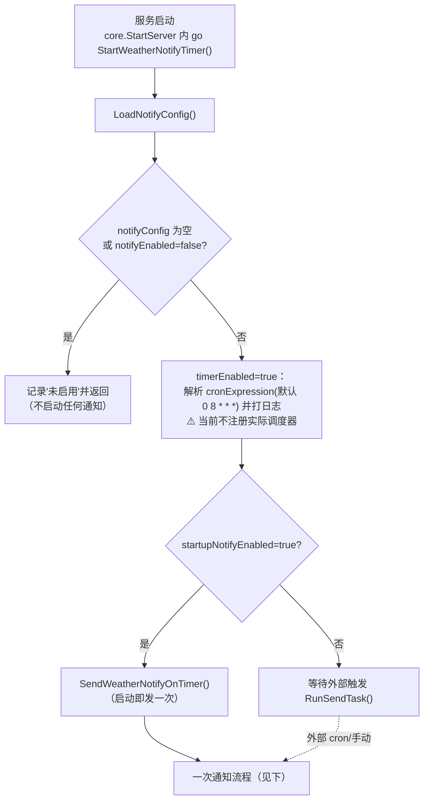
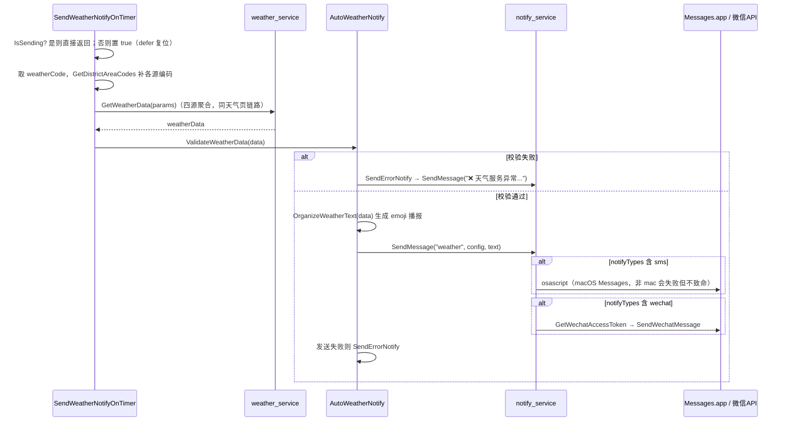
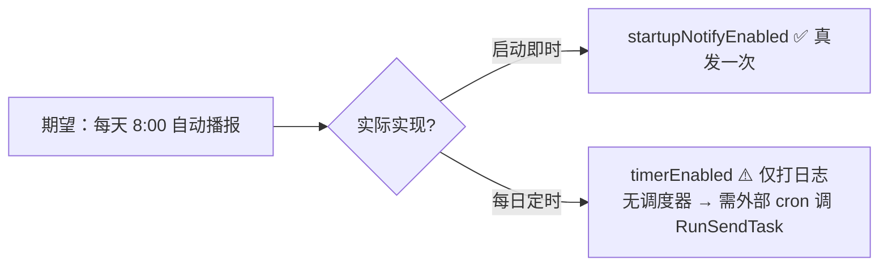

# 独立业务：天气定时通知（weather-notify）

> 生成时间：2026-09-10 ｜ 代码版本：master@40a4f33 ｜ 应用版本：v1.0.2

## 为什么单列一篇

天气定时通知是一项**没有对应 App 页面**的业务：它不由用户点击触发、不在任何 iframe 里呈现，而是随服务启动在后台运行，复用天气查询的取数能力、经消息通知渠道推送。它**横跨多个后端服务**（`weather_service` + `location_service` + `notify_service`），无法归入[天气查询页面](../02-pages/weather.md)的「界面 → 调用链」框架，故独立成文。

- 前端模块：无（纯后端）
- 后端：[auto_weather_notify_service.go](../../../app/services/auto_weather_notify_service.go)、[notify_service.go](../../../app/services/notify_service.go)
- 配置：`data/config/notify_config.json`
- 复用：[weather.md](../02-pages/weather.md) 的四源聚合取数

## 1. 业务定位与用户价值

到点自动把某地天气推送到用户的手机（短信/iMessage）或微信，无需打开应用。典型场景：每天早上 8 点收到常驻城市的天气播报。

| 能力 | 说明 |
|---|---|
| 取数 | 复用 `weather_service` 四源聚合，保证与天气页看到的一致 |
| 文本化 | 把天气 map 组织成带 emoji 的富文本播报 |
| 多渠道 | 短信（macOS Messages，`osascript`）+ 微信（公众号客服消息） |
| 触发 | 启动即时通知 + 定时（配置项，见 §4 现状） |
| 兜底 | 数据校验失败 / 发送失败时推送错误警报 |

## 2. 组件与职责

| 组件 | 位置 | 职责 |
|---|---|---|
| `StartWeatherNotifyTimer()` | auto_weather_notify_service.go#L222 | 服务启动入口：加载配置、判断是否启用、可选即时通知 |
| `(*AutoWeatherNotify).SendWeatherNotifyOnTimer()` | auto_weather_notify_service.go#L154 | 一次完整通知流程（防重入 → 取数 → 校验 → 文本化 → 发送） |
| `RunSendTask()` | auto_weather_notify_service.go#L260 | 对外暴露的「执行一次通知」包装，供外部触发器调用 |
| `OrganizeWeatherText()` / `ValidateWeatherData()` / `SendErrorNotify()` | 同文件 | 文本化 / 数据校验 / 错误警报 |
| `SendMessage(type, target, msg)` | notify_service.go#L59 | 渠道分发：按 `notifyTypes` 决定走短信/微信 |
| `SendSMSMessage(phone, msg)` | notify_service.go#L123 | `osascript` 调用 macOS Messages.app（**仅 macOS**） |
| `GetWechatAccessToken()` / `SendWechatMessage(openId, msg)` | notify_service.go#L163/L224 | 微信公众号 access_token 获取(含缓存) + 客服消息发送 |
| `AutoWeatherNotify.IsSending` | 同文件 | 非原子 bool，防重入标志 |

## 3. 核心业务流程

一次通知流程 `SendWeatherNotifyOnTimer()`：

## 4. 配置、触发现状与已知限制

**`notify_config.json` 关键字段**（均在 `weather` 节点下）：

| 字段 | 含义 |
|---|---|
| `notifyEnabled` | 总开关，false 则整套通知不启动 |
| `weatherCode` | 要播报的统一区域编码 |
| `phoneNumber` / `wechatOpenId` | 短信 / 微信目标 |
| `notifyTypes` | `["sms","wechat"]` 渠道选择 |
| `timerEnabled` | 定时开关 |
| `cronExpression` | 计划时间，默认 `0 8 * * *` |
| `startupNotifyEnabled` | 服务启动时是否立即发一次 |

**触发现状（务必知悉）**：

- **启动即时通知**：`startupNotifyEnabled=true` 时，服务一启动就发一次——这是**当前真正会执行的路径**。
- **定时并未真正生效**：`StartWeatherNotifyTimer` 在 `timerEnabled=true` 时只是**解析 cron 并打印"每天 H:00 发送"日志**，代码里**没有 `time.Ticker`/cron 注册**去周期性调用 `SendWeatherNotifyOnTimer`。
- **外部触发**：包级 `RunSendTask()` 供「跑一次通知」用，但它既没被内部定时器调用、也没暴露成 HTTP 路由。若要真正的每日定时，需要外部调度器（如系统 cron）触发，或在代码内补一个调度 goroutine。

## 5. 技术要点

- **与天气页共享取数与缓存**：`GetWeatherData` 走同一套两级缓存，通知触发过一次后短时间内天气页可能直接命中该缓存（反之亦然）。
- **平台限制**：短信渠道依赖 `osascript`，仅 macOS 可用；Linux/Windows 需配微信渠道。`SendMessage` 内部对不可用渠道有错误处理，不影响整体。
- **错误自举**：数据缺失或发送失败会通过同一渠道推送「❌ 天气服务异常」警报，便于用户察觉配置/网络问题。
- **幂等/防抖**：`IsSending` 防并发重入，避免同一时刻多次触发叠加发送；为非原子 bool，竞态窗口极小。

---

*文档生成于 2026-09-10，基于代码版本 master@40a4f33。*
