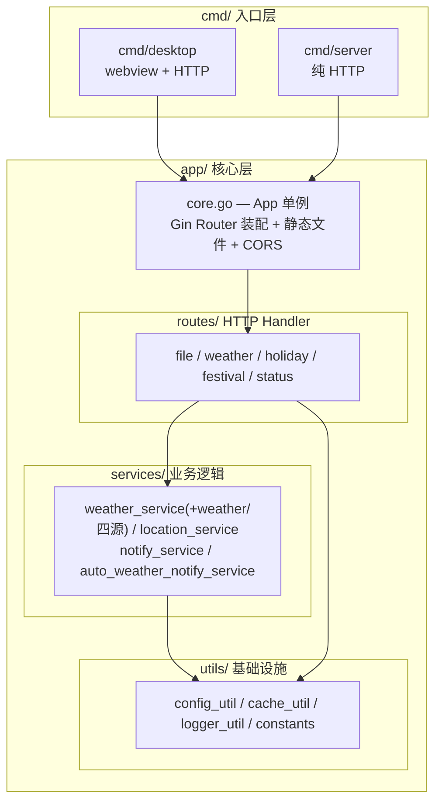
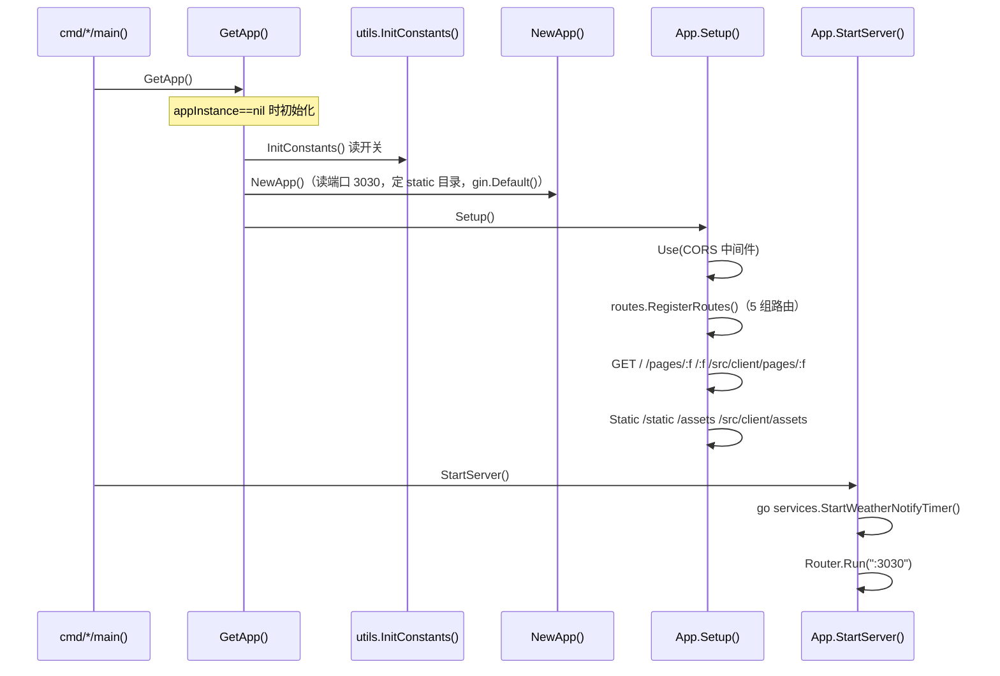
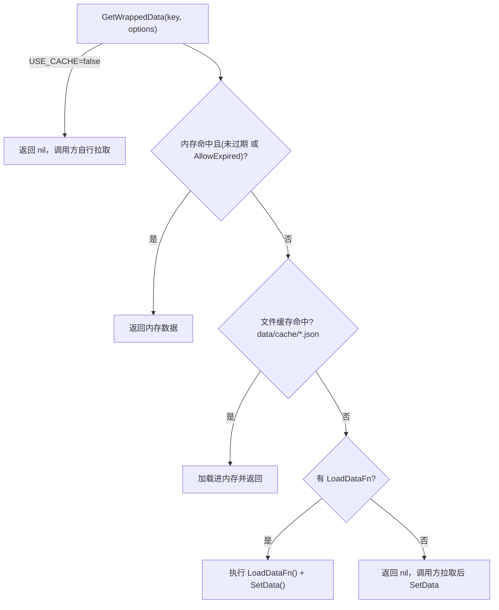

# 基础设施与横切关注点

> 生成时间：2026-09-10 ｜ 代码版本：master@40a4f33 ｜ 应用版本：v1.0.2

[02-pages/](02-pages/) 从页面维度讲「业务怎么走」，本文从**框架维度**讲「所有页面共用的地基」：应用如何启动、请求如何被路由、配置/缓存/日志/并发/错误/平台适配这些横切关注点如何统一支撑四个页面。

## 1. 分层与包结构

项目使用**轻量分层架构**，无 Clean Architecture 的 Domain/Repository 层，`routes` 直接调 `services`，`services` 复用 `utils`：



| 包路径 | 职责 | 不负责 |
|---|---|---|
| `cmd/desktop` | 桌面入口：创建 webview 窗口 + 启动 HTTP | 纯 HTTP 模式 |
| `cmd/server` | 纯 HTTP 入口：启动 Gin 无窗口 | GUI |
| `app`（core.go） | App 单例 + Gin 路由装配 + 静态文件 + 页面路由 + CORS | 具体业务逻辑 |
| `app/routes` | HTTP Handler：参数绑定 + 调 service + 组装 JSON | 业务/抓取/缓存策略 |
| `app/services` | 天气聚合、IP 定位、通知发送、定时调度 | HTTP Handler |
| `app/services/weather` | 单数据源的 HTTP 请求 + 响应解析（CMA/NMC/墨迹/天气网） | 多源合并 |
| `app/utils` | 配置、缓存、日志、全局常量/开关 | 业务逻辑 |

## 2. 应用启动生命周期

由 [core.go](../../app/core.go) 的懒初始化单例驱动：



- `NewApp()` 默认端口 **3030**，可被 `app_config.json` 的 `server.ports.go` 覆盖（[core.go#L27-L32](../../app/core.go#L25-L42)）。
- `cmd/desktop` 在 `main` 里额外用 `os.Chdir` 切到可执行文件目录、轮询等待服务就绪后再 `webview.New` 并 `Navigate("http://127.0.0.1:3030")`；`cmd/server` 复用同一 App，跳过窗口创建。

## 3. 路由与中间件

[Setup()](../../app/core.go#L44-L92) 注册了一个内联 CORS 中间件（允许所有来源、OPTIONS 直接 204）。因前后端同源且仅本地回环，`Access-Control-Allow-Origin: *` 是可接受的。

完整路由表：

| 方法 | 路径 | Handler | 所属页面 |
|---|---|---|---|
| GET | `/` | `serveIndex` | 外壳 |
| GET | `/pages/:filename` | `servePage` | 外壳 |
| GET | `/:filename` | `servePageWithExt` | 外壳 |
| GET | `/src/client/pages/:filename` | `serveClientPage` | 外壳（兼容别名） |
| GET | `/static/*`、`/assets/*`、`/src/client/assets/*` | `gin.Static` | 静态资源 |
| GET | `/api/file/scan` | `scanFiles` | [todo](02-pages/todo.md) |
| GET | `/api/file/read/:filename` | `readFile` | [todo](02-pages/todo.md) |
| POST | `/api/file/write/:filename` | `writeFile` | [todo](02-pages/todo.md) |
| GET | `/api/weather/ip-location` | `getIPLocation` | [weather](02-pages/weather.md) |
| GET | `/api/weather/weather-area-codes` | `getWeatherAreaCodes` | [weather](02-pages/weather.md) |
| GET | `/api/weather/weather-info` | `getWeatherInfo` | [weather](02-pages/weather.md) |
| GET | `/api/holiday/cache` | `getHolidayCache` | [calendar](02-pages/calendar.md) / [festival](02-pages/festival.md) |
| POST | `/api/holiday/refresh-cache` | `refreshHolidayCache` | [festival](02-pages/festival.md) |
| GET | `/api/festival/config` | `getFestivalConfig` | [calendar](02-pages/calendar.md) / [festival](02-pages/festival.md) |
| POST | `/api/festival/save` | `saveFestivalConfig` | [festival](02-pages/festival.md) |
| GET | `/api/check-status` | `checkStatus` | [todo](02-pages/todo.md) |
| POST | `/api/shutdown` | `shutdown` | [todo](02-pages/todo.md) |

## 4. 配置管理（config_util）

三类 JSON 配置由 [ConfigUtil](../../app/utils/config_util.go) 单例统一管理：

| 配置文件 | 配置名 | 内容 | 主要消费者 |
|---|---|---|---|
| `app_config.json` | `app` | 端口、API 超时、Mock/缓存开关、默认位置、日志开关 | 全局 |
| `notify_config.json` | `notify` | 天气通知配置（手机号、微信 AppId、定时/启动通知开关、通知类型） | 天气通知链路 |
| `festival_config.json` | `festival` | 自定义节日列表 | [节日管理](02-pages/festival.md) / [日历视图](02-pages/calendar.md) |

核心机制：

- **路径查找**：`getProjectRoot()` 区分 `.app` 包内运行（返回 `Contents/Resources`）与开发模式（向上找 `go.mod`），使同一套配置读取跨平台/跨运行形态可用。
- **缓存 + 热更新**：`configCache` + `sync.RWMutex`；首次读取缓存到内存，`SaveConfig` 写文件并同步刷新内存缓存。
- **类型安全取值**：`GetConfigValue(configName, keyPath, default)` 支持点号嵌套路径（如 `features.mock.enabled`）。
- **开关默认值**（[constants.go](../../app/utils/constants.go) 的 `InitConstants()`）：`USE_MOCK`=false、`USE_CACHE`=true、`PRINT_API_DATA`=false、`PRINT_DATA_LOG`=false。

## 5. 两级缓存（cache_util）

[CacheUtil](../../app/utils/cache_util.go) 提供内存 + 文件两级缓存，是所有页面「减少重复抓取/读盘」的地基：



关键特性：`TTL`（毫秒，0=永久 `Permanent`）、`AllowExpired`（过期兜底，主源失效时返回旧数据）、`SourceFile`（指定外部文件为源）、`LoadDataFn`（自定义加载，节假日用此模式）、`GenerateFileCacheKey`（文件内容缓存键）。

各页面缓存清单：

| 缓存 Key | 用途 | TTL | AllowExpired |
|---|---|---|---|
| `file_list` | todo 文件列表 | 5 分钟 | ❌ |
| `GenerateFileCacheKey(name)` | 单文件内容 | 5 分钟 | ❌ |
| 天气数据 `weatherCode_mojiCode` | 聚合后天气 | 1 小时 | ✅ |
| IP 位置 | 定位结果 | 1 小时 | ✅ |
| `holiday_cache` | 法定节假日 | 100 天 | ✅ |
| 区域编码 | 省市县编码映射 | 永久 | ✅ |
| 微信 access_token | 通知鉴权 | 按接口返回 | ❌ |

## 6. 日志体系（logger_util）

基于标准库 `log/slog` 的自建 [Logger](../../app/utils/logger_util.go) 封装：

- **动态级别**：`GlobalLevel *slog.LevelVar`，运行时可调。
- **双输出**：`io.MultiWriter(file, stdout)` 同时写 `data/logs/app.log` 与控制台。
- **调用栈修复**：`runtime.Callers` 跳过封装层，使 `AddSource` 能显示真实业务行号。
- **全局单例**：`LoggerInstance` 在 `init()` 阶段就绪，是最被广泛依赖的包。

## 7. 并发模型

无 worker pool，靠 goroutine + channel + sync 原语。四个页面共享同一套并发基础设施：

| 场景 | 模式 | 位置 |
|---|---|---|
| 天气四源并发抓取 | 7 个 goroutine + buffered channel(cap=1)，主协程阻塞等齐 | `weather_service.QueryWeatherData` |
| IP 双接口并发定位 | `sync.WaitGroup` 两 goroutine，任一成功选优 | `location_service.GetCurrLocation` |
| 后台定时通知 | `go` + `IsSending` 防重入 | `auto_weather_notify_service.StartWeatherNotifyTimer` |
| 区域编码映射 | `sync.Once` 一次性加载后只读 | `location_service.GetDistrictAreaCodes` |
| Gin 请求 | 每请求独立 goroutine，Gin 自动管理 | 全局 |

并发安全：

| 全局可变状态 | 保护方式 | 风险 |
|---|---|---|
| `ConfigUtil.configCache` | `sync.RWMutex` | 低 |
| `CacheUtil.memoryCache` | 无锁（假设单协程操作） | 低 |
| `areaCodesMap` | `sync.Once` 后只读 | 极低 |
| `AutoWeatherNotify.IsSending` | 非原子 bool（竞态窗口极小） | 极低 |

**已知风险**：天气抓取无全局超时兜底——单源卡死会拖到其 HTTP Client 自身超时（10~20s）才返回。

## 8. 错误处理策略

统一采用 **`map[string]interface{}` + `error` 字段** 模式，而非 Go 的 `error` 类型贯穿调用链：

```go
// 项目惯例
return map[string]interface{}{"error": map[string]interface{}{"message": "..."}}
```

- 部分数据源失败不阻塞整体：天气聚合跳过 error 源，返回其余数据。
- 业务 handler 统一返回 HTTP 200，错误在 JSON body 里；仅**参数校验类**用非 200（文件名非法 403、缺 `weatherCode` 400、节日字段错误 400）。

## 9. Context 传播（现状）

项目**未系统性使用 `context.Context`**。HTTP 请求为短平快同步调用，handler 不向 service 传 context，HTTP Client 直接 `&http.Client{Timeout: ...}` 硬编码超时。需要更精细超时/取消时，建议引入 `c.Request.Context()` 并在 service 层传递。

## 10. 平台适配（build tags + CGO）

| 机制 | 位置 | 作用 |
|---|---|---|
| `//go:build darwin` | `app/cmd/desktop/app_darwin.go` | macOS 专属 Cocoa 菜单 / `init()` 覆盖 |
| CGO | webview_go 依赖 | 三平台均需 `CGO_ENABLED=1` |
| 路径查找 | `config_util.getProjectRoot()` | 识别 `.app/Contents/MacOS` 运行形态 |
| osascript | `notify_service.SendSMSMessage` | 仅 macOS 的 Messages.app 短信 |
| lipo 合并 | `scripts/run_tools.sh` | macOS universal（amd64+arm64） |
| 构建依赖准备 | `scripts/run_tools.sh` 的 `ensure_build_deps` | Linux apt 装 GTK3/WebKit2GTK 并生成 `webkit2gtk-4.0.pc` 别名；Windows 探测/安装 MinGW-w64；macOS 校验 clang。release.yml 只做 checkout/setup-go/上传 |

| 能力 | macOS | Linux | Windows |
|---|---|---|---|
| webview | ✅ | ✅（需 webkit2gtk 4.0/4.1 开发包） | ✅ |
| Messages 短信 | ✅ | ❌ | ❌ |
| 微信通知 | ✅ | ✅ | ✅ |
| 交叉编译 | amd64/arm64 universal | 单架构 | 单架构 |

## 11. Graceful Shutdown

`/api/shutdown` → [status_routes.shutdown](../../app/routes/status_routes.go#L26-L37)：先返回 200，再起 goroutine sleep 1s 后向自身进程发 `SIGINT`；`SIGINT` 使 `webview.Run()` 返回、`main` 退出。桌面模式下用户直接关闭窗口同样终止 `Run()`。

**不足**：未调用 `http.Server.Shutdown(ctx)` 等待 in-flight 请求完成，也未显式停止后台通知 goroutine / 清理缓存写入。

---

*文档生成于 2026-09-10，基于代码版本 master@40a4f33。*
