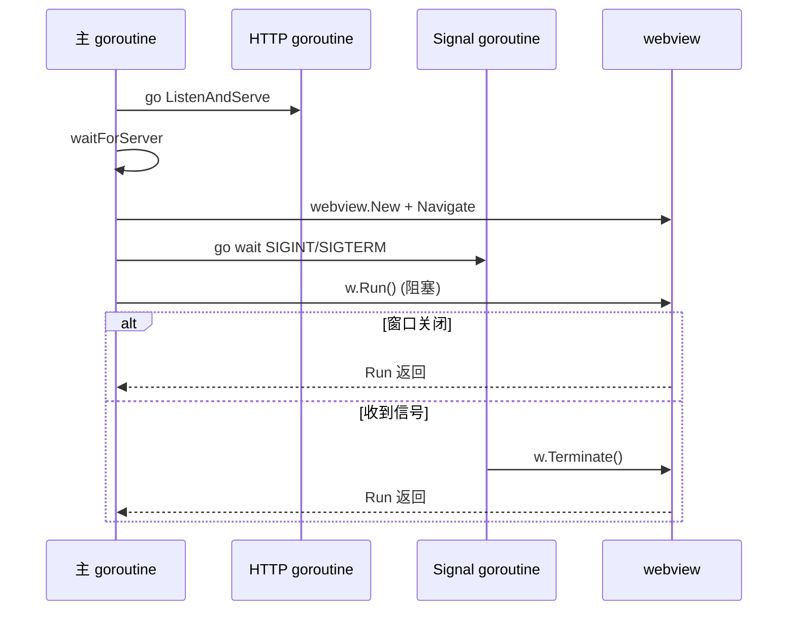

# 包：app/cmd/desktop（桌面应用入口）

> 生成时间：2026-08-01 ｜ 代码版本：master@d6f93a4

## 1. 定位与边界

`cmd/desktop` 是桌面应用的 `main` 包，负责启动内嵌 HTTP 服务并打开 webview 原生窗口。它**只做装配与生命周期管理**，不实现业务逻辑。

## 2. 目录结构

```
app/cmd/desktop/
├── app.go            # 跨平台主逻辑 + main 函数
└── app_darwin.go     # macOS 专属（//go:build darwin）
```

## 3. 核心功能列表

- 启动 Gin HTTP 服务（goroutine）
- 等待 HTTP 服务就绪（轮询 5 秒超时）
- 创建 webview 窗口（调试模式）
- 设置窗口标题与尺寸（1000×800）
- 平台专属退出菜单注入
- 监听 SIGINT/SIGTERM → 调用 `w.Terminate()`
- 运行 webview 主循环（阻塞）

## 4. 关键类型与职责

### [TodoApp](file:///Users/huji/work/MyProject/code_mine/gitee/todo_manager/todolist-go/app/cmd/desktop/app.go#L28)

桌面应用结构体，持有端口、URL、`AppInstance`、`http.Server`。

### [NewTodoApp](file:///Users/huji/work/MyProject/code_mine/gitee/todo_manager/todolist-go/app/cmd/desktop/app.go#L36)

构造函数，端口硬编码为 3002。

### [waitForServer](file:///Users/huji/work/MyProject/code_mine/gitee/todo_manager/todolist-go/app/cmd/desktop/app.go#L43)

轮询 `http://127.0.0.1:port/` 直到响应或超时。

### [startServer](file:///Users/huji/work/MyProject/code_mine/gitee/todo_manager/todolist-go/app/cmd/desktop/app.go#L57)

切到可执行文件目录，复用 `app.GetApp().Router`，在 goroutine 中 `ListenAndServe`。

### [Run](file:///Users/huji/work/MyProject/code_mine/gitee/todo_manager/todolist-go/app/cmd/desktop/app.go#L79)

主流程编排：startServer → waitForServer → 创建窗口 → 信号处理 → `w.Run()`。

### [setupQuitHandler](file:///Users/huji/work/MyProject/code_mine/gitee/todo_manager/todolist-go/app/cmd/desktop/app.go#L18)

平台特定钩子变量，默认 noop，macOS 在 [app_darwin.go](file:///Users/huji/work/MyProject/code_mine/gitee/todo_manager/todolist-go/app/cmd/desktop/app_darwin.go) 中重写。

### [setupQuitMenu](file:///Users/huji/work/MyProject/code_mine/gitee/todo_manager/todolist-go/app/cmd/desktop/app_darwin.go#L8)（macOS only）

cgo 函数，用 Objective-C 调用 Cocoa API 创建"Quit TodoManager"菜单项，绑定 Cmd+Q 快捷键。

## 5. 对外 API

`main` 包无导出 API。入口为 `main()` 函数。

## 6. 依赖关系

- **import**：`todolist-go/app`（别名 `localapp`）、`github.com/webview/webview_go`、`os`、`os/signal`、`syscall`、`net/http`、`path/filepath`、`time`
- macOS 额外：cgo + Cocoa 框架

## 7. 并发模型

- HTTP 服务在独立 goroutine 中运行。
- 信号处理在独立 goroutine 中等待 `<-sigChan`，触发 `w.Terminate()`。
- 主 goroutine 阻塞在 `w.Run()`，窗口关闭后返回。



## 8. 错误处理

- HTTP 服务启动失败：`log.Fatalf`。
- 服务就绪超时：打印警告并 return（不退出进程）。
- 端口冲突由 [test_app.sh](file:///Users/huji/work/MyProject/code_mine/gitee/todo_manager/todolist-go/test_app.sh) 在启动前用 `lsof` 释放。

## 9. 平台适配

| 文件 | build tag | 依赖 |
|---|---|---|
| [app.go](file:///Users/huji/work/MyProject/code_mine/gitee/todo_manager/todolist-go/app/cmd/desktop/app.go) | 无（所有平台） | webview_go |
| [app_darwin.go](file:///Users/huji/work/MyProject/code_mine/gitee/todo_manager/todolist-go/app/cmd/desktop/app_darwin.go) | `//go:build darwin` | cgo + Cocoa |

非 macOS 平台的 `setupQuitHandler` 在 [app.go init()](file:///Users/huji/work/MyProject/code_mine/gitee/todo_manager/todolist-go/app/cmd/desktop/app.go#L21-L25) 中设为 noop。

## 10. 配置项

无配置文件项；端口 3002 在构造函数中硬编码（与 `app.server.ports.go` 默认值一致）。

> 已知问题：`NewTodoApp` 硬编码 3002，未读取配置；`app.GetApp()` 内部读配置。两者需保持一致，建议未来统一从配置读取。
