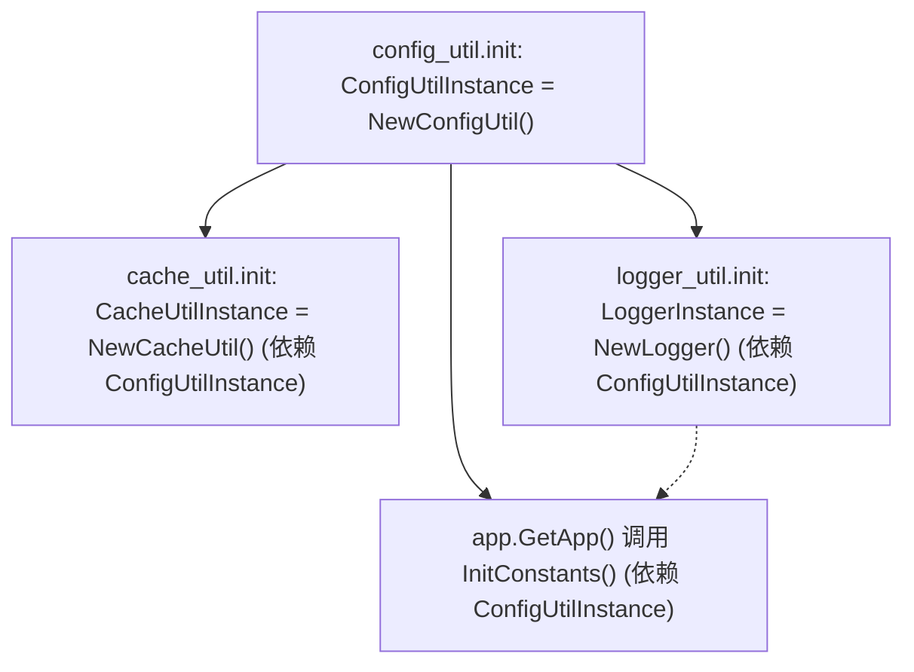

# 包：app/utils（基础设施工具层）

> 生成时间：2026-08-01 ｜ 代码版本：master@d6f93a4

## 1. 定位与边界

`utils` 是最底层的工具层，提供配置管理、缓存、日志、全局开关与目录常量。**不依赖任何业务包**，只依赖标准库。所有上层包（routes/services/services/weather）都依赖它。

## 2. 目录结构

```
app/utils/
├── config_util.go      # 配置文件读写 + 目录管理
├── cache_util.go       # 三级缓存
├── logger_util.go      # slog 结构化日志
└── constants.go        # 全局开关与默认位置
```

## 3. 核心功能列表

- 三份配置文件的读写（app/notify/festival）
- 项目根 / 数据 / 缓存 / 配置 / 天气 / Mock 目录定位与初始化
- 三级缓存（内存 → 文件 → 自定义加载器）
- 结构化日志（slog + 动态级别 + 行号修正）
- 全局特性开关（USE_MOCK/USE_CACHE/PRINT_API_DATA/PRINT_DATA_LOG）
- 默认位置信息
- API 超时配置读取

## 4. 关键类型与职责

### config_util.go

| 标识符 | 类型 | 说明 |
|---|---|---|
| [ConfigUtil](file:///Users/huji/work/MyProject/code_mine/gitee/todo_manager/todolist-go/app/utils/config_util.go#L14) | struct | 配置管理器，含目录与缓存 |
| [configDefinition](file:///Users/huji/work/MyProject/code_mine/gitee/todo_manager/todolist-go/app/utils/config_util.go#L27) | struct | 配置名→文件名映射 |
| [NewConfigUtil](file:///Users/huji/work/MyProject/code_mine/gitee/todo_manager/todolist-go/app/utils/config_util.go#L32) | func | 构造，自动创建 5 个子目录 |
| [getProjectRoot](file:///Users/huji/work/MyProject/code_mine/gitee/todo_manager/todolist-go/app/utils/config_util.go#L53) | func | 智能定位项目根（.app 包 / go.mod 回溯） |
| [GetConfig](file:///Users/huji/work/MyProject/code_mine/gitee/todo_manager/todolist-go/app/utils/config_util.go#L124) | method | 读取配置（带内存缓存） |
| [SaveConfig](file:///Users/huji/work/MyProject/code_mine/gitee/todo_manager/todolist-go/app/utils/config_util.go#L158) | method | 写入配置并更新缓存 |
| [GetConfigValue](file:///Users/huji/work/MyProject/code_mine/gitee/todo_manager/todolist-go/app/utils/config_util.go#L180) | method | 点分路径取值 |
| [RegisterConfig](file:///Users/huji/work/MyProject/code_mine/gitee/todo_manager/todolist-go/app/utils/config_util.go#L226) | method | 动态注册新配置 |
| [GetLocationAPITimeoutDuration](file:///Users/huji/work/MyProject/code_mine/gitee/todo_manager/todolist-go/app/utils/config_util.go#L258) | method | 位置 API 超时 |
| [GetWeatherAPITimeoutDuration](file:///Users/huji/work/MyProject/code_mine/gitee/todo_manager/todolist-go/app/utils/config_util.go#L262) | method | 天气 API 超时 |
| [GetWeatherAPIuTLSTimeoutDuration](file:///Users/huji/work/MyProject/code_mine/gitee/todo_manager/todolist-go/app/utils/config_util.go#L267) | method | uTLS 超时 |
| `ConfigUtilInstance` | var | 全局单例 |

### cache_util.go

| 标识符 | 类型 | 说明 |
|---|---|---|
| [MemoryCacheItem](file:///Users/huji/work/MyProject/code_mine/gitee/todo_manager/todolist-go/app/utils/cache_util.go#L13) | struct | 缓存项（data/timestamp/ttl/permanent） |
| [CacheOptions](file:///Users/huji/work/MyProject/code_mine/gitee/todo_manager/todolist-go/app/utils/cache_util.go#L21) | struct | 缓存选项（AllowExpired/SourceFile/Permanent/LoadDataFn/TTL） |
| [CachedData](file:///Users/huji/work/MyProject/code_mine/gitee/todo_manager/todolist-go/app/utils/cache_util.go#L30) | struct | 返回给调用方的包装数据 |
| [CacheUtil](file:///Users/huji/work/MyProject/code_mine/gitee/todo_manager/todolist-go/app/utils/cache_util.go#L38) | struct | 缓存管理器 |
| [GetWrappedData](file:///Users/huji/work/MyProject/code_mine/gitee/todo_manager/todolist-go/app/utils/cache_util.go#L276) | method | 三级回源核心 |
| [SetData](file:///Users/huji/work/MyProject/code_mine/gitee/todo_manager/todolist-go/app/utils/cache_util.go#L312) | method | 写入内存与文件 |
| [Delete](file:///Users/huji/work/MyProject/code_mine/gitee/todo_manager/todolist-go/app/utils/cache_util.go#L322) | method | 删除内存与文件 |
| [GenerateFileCacheKey](file:///Users/huji/work/MyProject/code_mine/gitee/todo_manager/todolist-go/app/utils/cache_util.go#L123) | method | 文件名转缓存 key |
| `CacheUtilInstance` | var | 全局单例 |

### logger_util.go

| 标识符 | 类型 | 说明 |
|---|---|---|
| [Logger](file:///Users/huji/work/MyProject/code_mine/gitee/todo_manager/todolist-go/app/utils/logger_util.go#L15) | struct | 日志工具 |
| [GlobalLevel](file:///Users/huji/work/MyProject/code_mine/gitee/todo_manager/todolist-go/app/utils/logger_util.go#L23) | var | `*slog.LevelVar` 动态级别 |
| [NewLogger](file:///Users/huji/work/MyProject/code_mine/gitee/todo_manager/todolist-go/app/utils/logger_util.go#L26) | func | 构造，输出到 data/logs/app.log + stdout |
| `(*Logger).Debug/Info/Warn/Error` | method | 高性能结构化 API |
| `LoggerInstance` | var | 全局单例 |

### constants.go

| 标识符 | 类型 | 说明 |
|---|---|---|
| `BASE_DIR/CACHE_DIR/MOCK_DIR/DATA_DIR/WEATHER_DIR` | var | 目录常量 |
| `DefaultLocation` | var | 默认位置（杭州） |
| `USE_MOCK/USE_CACHE/PRINT_API_DATA/PRINT_DATA_LOG` | var | 全局开关 |
| [InitConstants](file:///Users/huji/work/MyProject/code_mine/gitee/todo_manager/todolist-go/app/utils/constants.go#L26) | func | 从配置初始化开关与默认位置 |
| [GetDefaultLocation](file:///Users/huji/work/MyProject/code_mine/gitee/todo_manager/todolist-go/app/utils/constants.go#L52) | func | 获取默认位置 |

## 5. 对外 API

见上方 4 个表格。

## 6. 依赖关系

- **import**：`encoding/json`、`os`、`path/filepath`、`strings`、`sync`、`time`、`log/slog`、`context`、`runtime`、`io`、`fmt`、`regexp`
- **被 import**：所有上层包

## 7. 并发模型

### 7.1 配置缓存（[config_util.go](file:///Users/huji/work/MyProject/code_mine/gitee/todo_manager/todolist-go/app/utils/config_util.go#L23)）

`configCacheMutex sync.RWMutex` 保护 `configCache`：读用 RLock，写用 Lock。**唯一正确并发化的缓存。**

### 7.2 通用缓存的未加锁（[cache_util.go](file:///Users/huji/work/MyProject/code_mine/gitee/todo_manager/todolist-go/app/utils/cache_util.go#L39)）

`memoryCache map[string]*MemoryCacheItem` **未加锁**。多 goroutine 并发读写存在数据竞争风险。当前未触发严重问题的原因：

- 大多数缓存写入发生在请求处理早期（单 goroutine 内）
- 天气查询的 7 个 goroutine **只读**缓存（在 fan-out 之前查缓存），不写入
- 写入发生在主 goroutine 收集所有结果后

但理论上仍有竞态（如多个用户同时触发未命中的天气查询）。详见 [ADR-0005](05-adr/0005-缓存并发安全权衡.md)。

### 7.3 init 顺序



Go 包初始化按依赖顺序执行，`utils` 内三个 init 顺序由文件名首字母决定：`cache_util` → `config_util` → `logger_util`。`cache_util.init` 中 `NewCacheUtil` 检测 `ConfigUtilInstance == nil` 时手动创建（[cache_util.go#L48-L50](file:///Users/huji/work/MyProject/code_mine/gitee/todo_manager/todolist-go/app/utils/cache_util.go#L48-L50)），规避顺序问题。

## 8. 错误处理

- 配置文件不存在：返回空 map + warn 日志（与 Python 版对齐）
- 配置 JSON 解析失败：返回空 map + error 日志（不向上抛错）
- 缓存文件读写失败：error 日志，返回 nil/false
- 日志文件打开失败：回退到 stdout

## 9. 平台适配

无平台特定代码。

## 10. 配置项

`utils` 自身不消费业务配置，但 [InitConstants](file:///Users/huji/work/MyProject/code_mine/gitee/todo_manager/todolist-go/app/utils/constants.go#L26) 读取以下 `app` 配置 key：

| 配置 key | 类型 | 默认值 | 影响的全局变量 |
|---|---|---|---|
| `features.mock.enabled` | bool | false | `USE_MOCK` |
| `features.cache.enabled` | bool | true | `USE_CACHE` |
| `logs.print_api_data` | bool | false | `PRINT_API_DATA` |
| `logs.print_data_log` | bool | false | `PRINT_DATA_LOG` |
| `features.default_location` | object | 杭州 | `DefaultLocation` |

## 11. 目录定位策略

[getProjectRoot](file:///Users/huji/work/MyProject/code_mine/gitee/todo_manager/todolist-go/app/utils/config_util.go#L53) 的优先级：

1. 检测可执行文件路径，若包含 `.app/Contents/MacOS`，返回 `Contents/Resources`（.app 包内运行）
2. 否则从当前工作目录向上查找 `go.mod`，找到即返回
3. 都找不到返回 `.`（兜底）

这保证：

- 开发模式（`go run` 或 `./test_app.sh`）：从项目根找到 `data/` 与 `static/`
- 生产模式（.app 双击启动）：从 `Contents/Resources` 找到打包进去的 `data/` 与 `static/`
