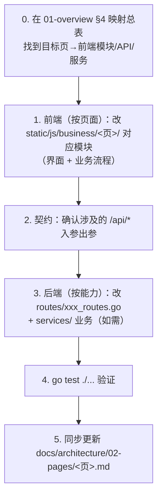
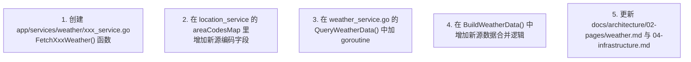
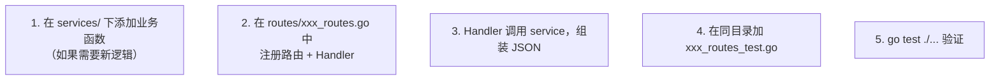
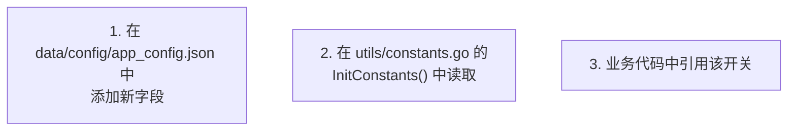

# 开发维护手册

> 生成时间：2026-09-10 ｜ 代码版本：master@40a4f33

## 1. 代码规范

### 1.1 包命名

- 小写蛇形：`weather_service`、`location_service`
- **避免**：`all`、`utils`（项目已有 utils 包，不要再加）、`common`、`helpers`
- 每个包一个职责：`services/weather` 子包每个源一个文件（CMA、NMC、墨迹、天气网）

### 1.2 文件命名

| 类型 | 命名 | 示例 |
|---|---|---|
| 主实现 | `xxx_service.go` | `weather_service.go` |
| 平台特定 | `*_darwin.go` / `*_linux.go` | `app_darwin.go` |
| 单元测试 | `xxx_test.go` | `weather_routes_test.go` |
| 测试入口 | `test_xxx_test.go`（项目中 Go 测试文件的命名风格） | `test_todo_manager_test.go` |

### 1.3 接口设计

Go 惯例：**接口定义在消费方**，而非实现方。当前项目未用到这个模式，所有函数都是包级别导出。新增功能时保持一致即可。

### 1.4 错误处理规范

项目采用 **map 返回 + error 字段** 模式，不使用 Go 的 `error` 类型贯穿调用链。新增代码请保持一致：

```go
// ✅ 项目现有模式
return map[string]interface{}{"error": map[string]interface{}{"message": "..."}}

// ❌ 不要引入
return nil, fmt.Errorf("...")
```

Handler 层统一返回 HTTP 200，业务错误在 JSON body 里的 `error` 字段表达。

### 1.5 并发规范

| 场景 | 模式 | 参考 |
|---|---|---|
| 多源并发抓取 | goroutine + buffered channel | [QueryWeatherData()](../../app/services/weather_service.go#L325-L433) |
| 双接口定位 | goroutine + sync.WaitGroup | [GetCurrLocation()](../../app/services/location_service.go#L171-L231) |
| 后台定时器 | go + 防重入 flag | [StartWeatherNotifyTimer()](../../app/services/auto_weather_notify_service.go#L222-L257) |

**约束**：
- 启动 goroutine 前确保有 timeout（HTTP Client 的 Timeout 字段）
- 后台 goroutine 要考虑如何停止（当前项目没实现，新增时注意）
- channel buffer 设 1，不阻塞生产者

### 1.6 导出标识符命名

驼峰命名，首字母大小写决定可见性：
- 导出：`GetWeatherData`、`BuildWeatherData`、`CacheUtilInstance`
- 未导出：`getStr3`、`mergeMaps`、`cmaHTTPClientOnce`

## 2. 新增功能流程

### 场景 0：改动 / 新增一个页面功能（页面维度主线）

本项目**文档与前端按「页面」组织**（`static/js/business/<页>/`），**后端按「能力/领域」组织**（`routes`/`services`/`utils`），二者通过 [01-overview §4](01-overview.md) 的「页面↔后端映射总表」关联。改动时以页面为入口，沿调用链自上而下贯穿到能力层：



> 例：给天气页加一个「生活指数」板块 → 改 `weather/weather_renderer.js`（渲染）→ 若数据后端已有则复用 `/api/weather/weather-info`，否则扩 `weather_service` 并在 `weather_routes` 暴露 → 更新 `02-pages/weather.md`。

### 场景 A：新增一个天气数据源



### 场景 B：新增一个 API 接口



### 场景 C：新增一个配置项



### 场景 D：新增一个缓存

```go
// 在 service 中使用 CacheUtilInstance
cacheOptions := utils.CacheOptions{
    TTL:          3600000,              // 1小时
    AllowExpired: true,                 // 允许过期兜底
    LoadDataFn:   func() (interface{}, error) {
        return fetchFromRemote(), nil   // 可选：自定义加载函数
    },
}

// 读
cached := utils.CacheUtilInstance.GetWrappedData("my_key", cacheOptions)

// 写（非 LoadDataFn 模式）
utils.CacheUtilInstance.SetData("my_key", data, cacheOptions)

// 删
utils.CacheUtilInstance.Delete("my_key")
```

## 3. 测试约定

### 运行测试

```bash
# 一键测试
./scripts/run_tools.sh test

# 或直接 go test
go test -race -count=1 ./...
```

### 表驱动测试

项目现有测试基本都是表驱动（table-driven tests）模式，新增测试保持一致：

```go
func TestBuildWeatherData(t *testing.T) {
    tests := []struct {
        name    string
        input   map[string]interface{}
        wantOk  bool
    }{
        {"正常数据", validInput, true},
        {"空数据", emptyInput, false},
        {"部分缺失", partialInput, false},
    }

    for _, tt := range tests {
        t.Run(tt.name, func(t *testing.T) {
            // 测试逻辑
        })
    }
}
```

### 测试文件位置

- **Go 单元测试**：与源文件同目录，`_test.go` 后缀
- 项目中现有测试文件命名为 `test_xxx_test.go`（符合 Go 惯例）

### Mock 策略

项目内置 Mock 开关，通过 `app_config.json` 的 `features.mock.enabled` 控制。Mock 数据放在 `data/mock/` 下。

---

*文档生成于 2026-09-10，基于代码版本 master@40a4f33。*
