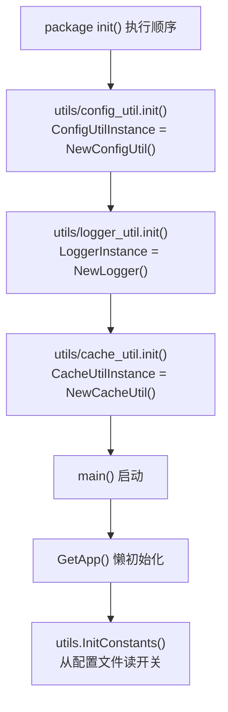

# 常见问题 FAQ

> 生成时间：2026-09-10 ｜ 代码版本：master@40a4f33

## 1. 运行时问题

### Q: go run ./app/cmd/desktop 报错 "CGO_ENABLED=1 but no C compiler"

**原因**：webview_go 需要 CGO，编译桌面应用必须有 C 编译器。

**解决**：
- macOS：`xcode-select --install`
- Linux：`sudo apt install gcc pkg-config libgtk-3-dev libwebkit2gtk-4.1-dev`（或直接跑 `./scripts/run_tools.sh build` 自动补齐）
- Windows：Git Bash + 系统 MSVC 或 MinGW

### Q: 服务启动后访问 http://127.0.0.1:3030 报错

**排查**：
1. 确认端口没有被占用：`lsof -i:3030`（macOS/Linux）
2. 确认已从项目根目录运行：`./scripts/run_tools.sh server`
3. 查看日志：`cat data/logs/app.log`

### Q: 桌面应用启动后 webview 白屏

**原因**：工作目录不正确，`static/` 目录找不到。

**解决**：
- 开发模式下确保在项目根目录运行
- 生产 .app 包通过 `os.Chdir(filepath.Dir(exe))` 自动处理

### Q: 天气接口全部返回空数据

**排查步骤**：
1. 检查是否开启了 Mock 模式（`app_config.json` → `features.mock.enabled`）
2. 检查网络是否能访问四个数据源（CMA、NMC、墨迹、天气网）
3. 查看日志：`cat data/logs/app.log | grep -i "weather\|fetch\|error"`
4. 尝试 `forceRefresh=true` 参数绕过缓存

### Q: CMA 天气请求报错，其他三个源正常

**原因**：CMA 有反爬机制，需要 uTLS 模拟浏览器指纹。

**排查**：
1. 如果 uTLS 初始化失败，会 fallback 到其他三个源
2. 查看日志是否有 uTLS 相关错误
3. uTLS 超时默认 20s（`api_timeout_weather_utls`），网络慢时可调大

### Q: macOS 下编译 universal binary 报错

**原因**：CGO + universal 构建需要同时编译两个架构。

**解决**：直接用项目脚本：
```bash
./scripts/run_tools.sh build
```
它会自动分别编译 amd64/arm64 然后 lipo 合并。

### Q: Linux 下构建报错 "webkit2gtk-4.0 not found"

**原因**：webview_go 的 cgo 指令硬编码 `pkg-config: gtk+-3.0 webkit2gtk-4.0`，但 Ubuntu 24.04 起官方源已移除 `libwebkit2gtk-4.0-dev`，只提供 4.1 的开发包（旧系统则可能两个都没装）。

**解决**：直接执行 `./scripts/run_tools.sh build` 即可 —— `ensure_linux_deps` 会自动 apt 安装缺失的 GTK3/WebKit2GTK 开发包，并在只装到 4.1 时生成 `webkit2gtk-4.0.pc` 兼容别名（CI 与本地同一条路径）。若需手动处理：
```bash
sudo apt update
sudo apt install pkg-config libgtk-3-dev libwebkit2gtk-4.1-dev
# 装了 4.1 但 pkg-config 仍找不到 4.0 时，复制一份同名 .pc 做别名（其内容本就指向 4.1）
pc_dir=$(pkg-config --variable=pcfiledir webkit2gtk-4.1)
sudo cp "$pc_dir/webkit2gtk-4.1.pc" "$pc_dir/webkit2gtk-4.0.pc"
pkg-config --cflags --libs gtk+-3.0 webkit2gtk-4.0   # 验证能完整解析
```
非 apt 发行版（Fedora/Arch 等）脚本会直接报错提示手动安装对应包名；Windows 上则会自动探测 MSYS2/MinGW-w64 目录，必要时用 chocolatey 安装。

### Q: 修改前端 JS 后桌面应用没有更新

**原因**：.app 包里的 static 是构建时拷贝过去的，修改源码里的 static/ 不会自动同步。

**解决**：重新执行构建：`./scripts/run_tools.sh run`（会自动增量构建）

## 2. 开发问题

### Q: 全局变量初始化顺序是怎样的？



**关键约束**：`ConfigUtilInstance` 必须在 `LoggerInstance` 和 `CacheUtilInstance` 之前初始化，因为后两者依赖前者的路径查找。Go 编译器保证同一个包内的 init 顺序，跨包则按 import 顺序。

### Q: 为什么用 map[string]interface{} 而不是定义 struct？

**理由**（来自项目背景）：
1. 项目从 Python Flask 重写而来，保持了动态 JSON 结构的风格
2. 天气数据字段多且各源不一致，动态 map 比 struct 灵活
3. 前后端接口直接透传，无需额外序列化层

**缺点**：失去了 Go 的类型安全。如果后续业务稳定，建议为核心数据结构定义 struct。

### Q: 并发抓取有没有 timeout 兜底？

**当前实现**：**没有全局 timeout**。每个数据源的 HTTP Client 有各自的 Timeout（10s 或 20s），但如果所有源都在等超时，整个请求会阻塞 20 秒以上。

**建议改进**：用 `sync.WaitGroup` + context，或加一个总超时 goroutine。

### Q: 缓存失效策略是什么？

| 缓存 Key | TTL | 允许过期 |
|---|---|---|
| 天气数据 | 1 小时 | ✅ |
| IP 位置 | 1 小时 | ✅ |
| todo 文件列表 | 5 分钟 | ❌ |
| todo 文件内容 | 5 分钟 | ❌ |
| 节假日 | 100 天 | ✅ |
| 天气区域编码 | 永久 | ✅ |
| 微信 access_token | 按接口返回 | ❌ |

### Q: 如何新增一个功能开关？

1. 在 `data/config/app_config.json` 添加字段：
```json
{
  "features": {
    "my_feature": { "enabled": false }
  }
}
```

2. 在 `utils/constants.go` 添加全局变量 + InitConstants 中读取：
```go
var MY_FEATURE bool = false

func InitConstants() {
    // ...现有代码...
    if v, ok := ConfigUtilInstance.GetConfigValue("app", "features.my_feature.enabled", false).(bool); ok {
        MY_FEATURE = v
    }
}
```

3. 业务代码中引用 `utils.MY_FEATURE`

### Q: 为什么没有 context.Context？

**技术债说明**：
- 项目是从 Python Flask 重写过来的，Python 没有 context 概念
- Go 项目重写时也没有系统性引入 context
- 短期不阻塞，但新增功能（特别是需要精细超时的）建议引入

**示例改造方向**：
```go
// 当前
func QueryWeatherData(params map[string]interface{}) map[string]interface{}

// 建议
func QueryWeatherData(ctx context.Context, params map[string]interface{}) map[string]interface{}
```

### Q: macOS Messages 短信在 Linux/Windows 下会怎样？

会失败。`osascript` 只在 macOS 上有。代码里已经有错误处理，会返回失败而不影响整体。如果你要做跨平台通知，建议优先配置微信公众号。

## 3. 发布问题

### Q: release.yml 的触发条件是什么？

推送 `v*` 格式的 tag 时自动触发：
```bash
git tag v1.0.3
git push origin v1.0.3
```

### Q: 怎么在本地打 DMG？

```bash
./scripts/run_tools.sh build
# 产物在 dist/TodoManager_v*_macos.dmg
```

**注意**：`hdiutil` 只有 macOS 上有，Linux/Windows 本地打不了 DMG。需要在 CI 的 macOS runner 上构建。

### Q: 版本号从哪里读？

`version.txt` 文件（当前值：1.0.2）。发布前更新这个文件即可。

---

*文档生成于 2026-09-10，基于代码版本 master@40a4f33。*
